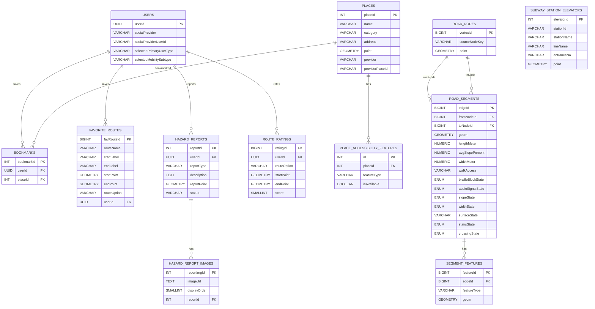

# 📋 ERD v3 — SHP 기반 보행 네트워크 및 편의시설 카테고리 최신화

> **작성일:** 2026-04-23
> **기준 문서:** `docs/erd.md` (원본 OSM 기반)
> **최종 수정일:** 2026-04-29
> **변경 사유:** canonical source를 `busan.osm.pbf`에서 `N3L_A0020000_26` SHP(국토교통부 도로 중심선)로 전환함에 따라 `road_nodes`와 `road_segments`의 source identity 컬럼을 재정의하고, 편의시설 PoC 채택본 기준으로 장소 카테고리를 최신화
> **참조 계획:** `.ai/PLANS/current-sprint/02-osm-schema-and-network-load.md`

---

## 변경 요약

| 테이블 | 변경 전 | 변경 후 |
|--------|----------------------|----------------------|
| `road_nodes` | `osmNodeId BIGINT` | `sourceNodeKey VARCHAR(100)` |
| `road_segments` | `sourceWayId`, `sourceOsmFromNodeId`, `sourceOsmToNodeId`, `segmentOrdinal` | - |
| `users` | `disabilityGrade`, `phoneNumber`, `pushEnabled`, `profileCompleted`, `nickname`, 온보딩/약관/설정 boolean | 가입 완료 사용자 계정과 `selectedPrimaryUserType`, 조건부 `selectedMobilitySubtype`만 저장 |
| `places` | `BUS_STATION`, `ELEVATOR`, `BARRIER_FREE_FACILITY`, `TOILET`, `RESTAURANT`, `CHARGING_STATION` 카테고리 | `FOOD_CAFE`, `HEALTHCARE`, `WELFARE`, `PUBLIC_OFFICE`, `ETC` 카테고리 |
| `hazard_reports` | 익명 제보, 주소 저장, 8개 제보 유형 | 사용자 계정 연결, 좌표 중심 저장, 6개 제보 유형 |
| `road_segments` | `curbRampState`, `elevatorState`, 넓은 `surfaceState` 후보 | `slopeState`, `elevatorState` 제거, 단순화한 `surfaceState`/`crossingState` |
| `route_logs`, `route_log_points` | 실제 이동 로그 수집 | MVP ERD에서 제외 |
| `route_ratings` | - | 도착 직후 별점 평가 저장 |

장소 카테고리, 장소 접근성 속성, 온보딩 저장 정책, 제보/평가 저장 정책은 2026-04-29 논의 결과를 기준으로 갱신한다. 카카오/공공데이터 원천 카테고리명은 MVP DB 컬럼으로 보존하지 않고, 서비스 필터 기준은 항상 `places.category`와 `place_accessibility_features.featureType`으로 둔다.

---

## 1. 설계 기준

- 기준 문서: `2026-04-10 최종_프로젝트_기획서.md`, `2026-04-11_MVP_화면명세서.md`, `2026-04-09_기능명세서.md`, `2026-04-16_ACCESSIBLE_ROUTING_POC_RESTART_BLUEPRINT.md`
- `createdAt`, `updatedAt`은 JPA Auditing 기반 `BaseEntity` 공통 컬럼으로 관리하므로 테이블별 상세 명세에서는 생략한다.
- 회원 탈퇴는 물리 삭제 대신 soft delete를 기본으로 하며, 필요 시 `deletedAt`을 공통 컬럼으로 관리한다.
- 모든 컬럼 네이밍은 `camelCase`를 사용한다.
- 숫자 ID를 참조하는 외래키 컬럼은 자동 증가 컬럼이 아니므로 `SERIAL/BIGSERIAL`이 아니라 `INT/BIGINT`로 표기한다.
- PK는 테이블별 데이터 증가량 기준으로 구분한다. 대량 적재 또는 로그성 테이블은 `BIGINT`, 일반 관리성 테이블은 `INT`를 우선 검토한다.
- 사용자 식별자인 `users.userId`는 API 응답, JWT subject, FK에서 모두 UUID를 사용한다.
- 소셜 OAuth 인증은 서비스 회원가입과 분리한다. `users` row는 필수 약관 동의와 온보딩 선택값이 모두 확정된 뒤 생성하므로, 가입 완료 사용자만 저장한다.
- 시간 데이터는 DB에 표시용 문자열 형식으로 저장하며, `VARCHAR` 컬럼에 ISO 8601 기반 문자열을 저장하는 것을 기본 원칙으로 한다.
- 변경 가능성이 있거나 운영 중 값 집합이 늘어날 수 있는 비즈니스 필드는 DB ENUM 대신 `VARCHAR`를 사용한다.
- `roadSegments`의 접근성/보행 상태처럼 라우팅 로직에서 사용하는 고정된 폐쇄 집합 값은 ENUM 사용을 허용하되, `surfaceState`처럼 분류 기준이 확장될 수 있는 필드는 `VARCHAR`를 사용한다.
- 지도/장소 검색 API는 MVP 기준 카카오 단일 사용을 전제로 한다.
- 대중교통 경로 후보는 ODsay 같은 외부 대중교통 길찾기 API를 우선 사용하고, 버스/저상버스 정보는 부산광역시_부산버스정보시스템 OpenAPI를 실시간 조회한다.

---

## 2. 도메인 구성

### 사용자 도메인

- `users`
- `bookmarks`
- `favorite_routes`
- `hazard_reports`
- `hazard_report_images`
- `route_ratings`

### 장소 도메인

- `places`
- `place_accessibility_features`

### 보행 네트워크 도메인

- `road_nodes`
- `road_segments`
- `segment_features`

### 대중교통 도메인

- `subway_station_elevators`
- ODsay 등 외부 대중교통 길찾기 API로 경로 후보 조회
- 부산광역시_부산버스정보시스템 OpenAPI로 버스 실시간 도착/저상버스 여부 조회
- 부산교통공사 공공데이터로 지하철 시간표/역 접근성 정보 보강
- 저상버스 예약은 백엔드 API 없이 프론트에서 부산시버스정보시스템 외부 화면 직접 연결

---

## 3. ERD 다이어그램

---

## 4. 테이블별 명세

---

## 1) users

### 역할

서비스 가입이 완료된 사용자의 계정 식별 정보와 사용자 유형을 저장한다.

### 컬럼 명세

| 한글명 | 영어명 | 타입 | NULL | DEFAULT |
| --- | --- | --- | --- | --- |
| 사용자 PK | userId | UUID | NOT NULL |  |
| 소셜 제공자 | socialProvider | VARCHAR(30) | NOT NULL |  |
| 소셜 사용자 ID | socialProviderUserId | VARCHAR(100) | NOT NULL |  |
| 1차 사용자 유형 | selectedPrimaryUserType | VARCHAR(30) | NOT NULL |  |
| 보행약자 세부 유형 | selectedMobilitySubtype | VARCHAR(30) | NULL |  |

### 제약

- `UNIQUE (socialProvider, socialProviderUserId)`

### 비고

- 소셜 OAuth 인증만 완료된 상태는 아직 서비스 회원이 아니다. 필수 약관 동의와 온보딩 선택값을 받은 뒤 `users` row를 생성한다.
- 따라서 `selectedPrimaryUserType`은 `NOT NULL`이다. 온보딩 미완료 상태를 나타내는 별도 완료 필드는 두지 않는다.
- `nickname`은 MVP 사용자 테이블에 저장하지 않는다. 마이페이지 표시명이 필요하면 소셜 프로필 응답 또는 후속 프로필 정책에서 별도로 정한다.
- `selectedPrimaryUserType` 후보값은 `LOW_VISION`, `MOBILITY_IMPAIRED`다.
- `selectedPrimaryUserType=LOW_VISION`이면 `selectedMobilitySubtype`은 `NULL`이어야 한다.
- `selectedPrimaryUserType=MOBILITY_IMPAIRED`이면 `selectedMobilitySubtype`은 한 개만 저장한다.
- `selectedMobilitySubtype` 후보값은 `POWER_WHEELCHAIR`, `MANUAL_WHEELCHAIR`, `OTHER_MOBILITY`다.
- 필수 약관 동의는 가입 완료 조건으로 검증하지만, `users` 테이블에 별도 동의 여부 필드를 저장하지 않는다.
- 푸시 알림, 진동 알림, TTS, 경로 데이터 수집 설정은 서버에 저장하지 않고 앱 내부 설정 또는 후순위 정책으로 관리한다.
- 회원 탈퇴는 물리 삭제 대신 soft delete를 기본으로 하며, 동일 사용자 재가입 시 기존 계정 복구 또는 재활성화 정책을 별도로 둔다.
- `userId`는 외부 응답과 JWT subject에도 사용되는 UUID다.

---

## 2) bookmarks

### 역할

사용자가 찜한 장소를 저장한다.

### 컬럼 명세

| 한글명 | 영어명 | 타입 | NULL | DEFAULT |
| --- | --- | --- | --- | --- |
| 북마크 ID | bookmarkId | INT | NOT NULL |  |
| 사용자 PK | userId | UUID | NOT NULL |  |
| 장소 ID | placeId | INT | NOT NULL |  |

### 비고

- `UNIQUE (userId, placeId)` 제약을 둔다.

---

## 3) favorite_routes

### 역할

사용자가 저장한 자주 가는 길 데이터를 관리한다.

출발지/도착지/경로 옵션을 기반으로 재탐색 가능한 입력값 저장 구조다.

실제 edge 목록이나 안내 경로 상세를 저장하지 않는다.

### 컬럼 명세

| 한글명 | 영어명 | 타입 | NULL | DEFAULT |
| --- | --- | --- | --- | --- |
| 자주 가는 길 ID | favRouteId | BIGINT | NOT NULL |  |
| 경로명 | routeName | VARCHAR(511) | NOT NULL |  |
| 출발지명 | startLabel | VARCHAR(255) | NOT NULL |  |
| 도착지명 | endLabel | VARCHAR(255) | NOT NULL |  |
| 출발지 좌표 | startPoint | GEOMETRY(POINT, 4326) | NOT NULL |  |
| 도착지 좌표 | endPoint | GEOMETRY(POINT, 4326) | NOT NULL |  |
| 경로 종류 | routeOption | VARCHAR(30) | NOT NULL | SAFE |
| 사용자 PK | userId | UUID | NOT NULL |  |

### routeOption 후보값

- `SAFE`
- `SHORTEST`

### 비고

- `routeName`은 사용자가 직접 입력하지 않고 `startLabel`과 `endLabel`을 기준으로 자동 생성한다.
- 목록 정렬은 최신 저장순을 기본으로 한다.

---

## 4) hazard_reports

### 역할

사용자가 등록한 도로 위험 요소 제보 데이터를 저장한다.

도로 상태 제보는 로그인 사용자 계정과 연결한다. 회원 탈퇴 후에도 제보 내역은 운영 검토 기록으로 보관한다.

### 컬럼 명세

| 한글명 | 영어명 | 타입 | NULL | DEFAULT |
| --- | --- | --- | --- | --- |
| 사용자 제보 ID | reportId | INT | NOT NULL |  |
| 사용자 PK | userId | UUID | NOT NULL |  |
| 제보 유형 | reportType | VARCHAR(30) | NOT NULL |  |
| 설명 | description | TEXT | NULL |  |
| 제보 위치 | reportPoint | GEOMETRY(POINT, 4326) | NOT NULL |  |
| 상태 | status | VARCHAR(30) | NOT NULL | PENDING |

### 후보값

- `reportType`: `STAIRS_STEP`, `BRAILLE_BLOCK`, `SIDEWALK_MISSING`, `RAMP`, `SIDEWALK_WIDTH`, `OTHER_OBSTACLE`
- `status`: `PENDING`, `APPROVED`, `REJECTED`

### 비고

- 신규 제보는 기본적으로 `PENDING` 상태로 생성한다.
- `APPROVED`, `REJECTED` 상태 변경은 Slack 제보 검토 콜백 API에서 처리한다.
- 사용자 화면에는 처리 상태를 노출하지 않지만, 서버는 운영 검토를 위해 `status`를 관리한다.
- 제보 위치의 기준 데이터는 `reportPoint`다. 주소 문자열은 역지오코딩 표시값으로 볼 수 있으므로 MVP DB 컬럼으로 저장하지 않는다.
- 사용자별 제보 목록은 최신순으로 제공한다.

---

## 5) hazard_report_images

### 역할

사용자 제보에 첨부된 이미지 정보를 저장한다.

이미지 파일 자체는 S3 같은 외부 스토리지에 저장하고, DB에는 URL과 순서만 관리한다.

### 컬럼 명세

| 한글명 | 영어명 | 타입 | NULL | DEFAULT |
| --- | --- | --- | --- | --- |
| 제보 이미지 ID | reportImgId | INT | NOT NULL |  |
| 이미지 URL | imageUrl | TEXT | NOT NULL |  |
| 표시 순서 | displayOrder | SMALLINT | NOT NULL | 0 |
| 사용자 제보 ID | reportId | INT | NOT NULL |  |

### 비고

- `UNIQUE (reportId, displayOrder)` 제약을 둔다.
- 제보 사진은 선택 입력이며 최대 5장까지 허용한다.
- 목록 응답에서는 `displayOrder=0` 이미지를 대표 사진으로 사용하고, 상세 응답에서 전체 사진을 제공한다.

---

## 6) places

### 역할

지도에 노출되는 장소 마스터 데이터를 저장한다.

우리 서비스가 관리하는 보행약자 접근성 장소 마스터다. 카카오 검색 결과는 외부 검색 응답으로 우선 사용하고, 내부 장소와 매칭되는 경우에만 접근성 정보를 보강한다.

### 컬럼 명세

| 한글명 | 영어명 | 타입 | NULL | DEFAULT |
| --- | --- | --- | --- | --- |
| 장소 ID | placeId | INT | NOT NULL |  |
| 장소명 | name | VARCHAR(255) | NOT NULL |  |
| 카테고리 | category | VARCHAR(50) | NOT NULL |  |
| 주소 | address | VARCHAR(255) | NULL |  |
| 좌표 | point | GEOMETRY(POINT, 4326) | NOT NULL |  |
| 제공자 | provider | VARCHAR(30) | NOT NULL | PUBLIC_DATA |
| 제공자 장소 ID | providerPlaceId | VARCHAR(100) | NULL |  |

### category 후보값

- `FOOD_CAFE`
- `TOURIST_SPOT`
- `ACCOMMODATION`
- `HEALTHCARE`
- `WELFARE`
- `PUBLIC_OFFICE`
- `ETC`

### category 표시 기준

| category | 표시명 | 기준 |
| --- | --- | --- |
| `FOOD_CAFE` | 음식·카페 | 음식점, 카페, 제과점 등 식음 목적지 |
| `TOURIST_SPOT` | 관광지 | 관광지, 공원, 해변 등 방문 목적지 |
| `ACCOMMODATION` | 숙박 | 관광숙박, 일반숙박, 생활숙박 |
| `HEALTHCARE` | 의료·보건 | 병원, 의원, 치과, 한의원, 보건소, 종합병원 |
| `WELFARE` | 복지·돌봄 | 노인/장애인/아동/사회복지시설, 경로당, 요양시설 |
| `PUBLIC_OFFICE` | 공공기관 | 주민센터, 지자체 청사, 공단, 우체국, 파출소, 지구대 |
| `ETC` | 기타 편의시설 | 보행약자 편의시설 원천 근거는 있으나 대표 서비스 카테고리로 단정하기 어려운 장소 |

### 비고

- `provider` 후보값은 `KAKAO`, `PUBLIC_DATA`다. `ADMIN`, `INTERNAL`은 MVP 장소 원천 값으로 사용하지 않는다.
- 카카오 장소 ID를 내부 장소와 매칭 근거로 채택한 경우 `provider=KAKAO`, `providerPlaceId`에 저장할 수 있다. DB 기본키인 `placeId`는 내부 자동 증가 ID로 유지한다.
- `provider`, `providerPlaceId` 조합에 유니크 제약을 둔다. 단, 카카오 검색 결과를 북마크했다는 이유만으로 `places`를 자동 생성하지 않는다.
- 카카오 `category_name`과 공공데이터 원천 분류명은 MVP 장소 테이블 컬럼으로 저장하지 않는다. 서비스 필터 기준은 항상 `category`다.
- `BARRIER_FREE_FACILITY`는 최종 카테고리로 사용하지 않는다. 원천 장애인편의시설 데이터는 실제 시설 성격에 따라 `FOOD_CAFE`, `TOURIST_SPOT`, `ACCOMMODATION`, `HEALTHCARE`, `WELFARE`, `PUBLIC_OFFICE`, `ETC` 중 하나로 분류한다.
- `BUS_STATION`은 장소 도메인 최종 카테고리에서 제외한다. 대중교통 정류소는 대중교통 도메인에서 별도로 관리한다.
- `ELEVATOR`는 장소 카테고리로 사용하지 않는다. 도시철도 엘리베이터는 `subway_station_elevators`, 일반 장소의 엘리베이터 보유 여부는 `place_accessibility_features.featureType = elevator`로 관리한다.
- `TOILET`은 장소 카테고리로 사용하지 않는다. 장애인 이용 가능 화장실은 `place_accessibility_features.featureType = accessibleToilet`로 관리한다.
- `CHARGING_STATION`은 장소 카테고리로 사용하지 않는다. 전동보장구 충전소 장소는 `category=ETC`로 저장하고 반드시 `featureType=chargingStation`, `isAvailable=true`를 가진다.
- 최종 정제 산출물은 `place/erd_ready/place_merged_broad_category_final.csv` 기준 13,564개 장소이며, `TOILET`, `CHARGING_STATION`, `MOBILITY`, `FOOD`, `PUBLIC`, `MEDICAL_WELFARE` 구 카테고리는 남기지 않는다.

---

## 7) place_accessibility_features

### 역할

장소별 접근성 속성을 개별 row로 분리 저장한다.

### 컬럼 명세

| 한글명 | 영어명 | 타입 | NULL | DEFAULT |
| --- | --- | --- | --- | --- |
| 접근성 속성 ID | id | INT | NOT NULL |  |
| 장소 ID | placeId | INT | NOT NULL |  |
| 속성 유형 | featureType | VARCHAR(50) | NOT NULL |  |
| 제공 여부 | isAvailable | BOOLEAN | NOT NULL | false |

### featureType 후보값

- `accessibleEntrance`
- `elevator`
- `accessibleToilet`
- `accessibleParking`
- `chargingStation`
- `accessibleRoom`
- `guidanceFacility`

### 비고

- `UNIQUE (placeId, featureType)` 제약을 둔다.
- `accessibleEntrance`는 주출입구 접근 가능, 무단차 진입, 경사로형 접근로를 통합한 접근성 속성이다. 기존 `ramp`, `stepFree`는 별도 featureType으로 분리하지 않는다.
- 지도 홈 상단 빠른 필터는 장소 카테고리가 아니라 `accessibleToilet`, `elevator`, `chargingStation` 접근성 속성을 기준으로 조회한다.
- `chargingStation`은 전동보장구 충전 가능 여부를 뜻한다. 전동보장구 충전소 원천 장소는 `places.category=ETC`와 `chargingStation=true`를 함께 가져야 한다.

---

## 8) road_nodes *(v3 변경)*

### 역할

보행 네트워크 그래프의 정점(Vertex)을 저장한다.

SHP 선형의 시작/종료점에서 파생된 anchor node만 관리한다. source-agnostic 설계로 OSM, SHP 등 다양한 소스를 지원한다.

### 컬럼 명세

| 한글명 | 영어명 | 타입 | NULL | DEFAULT |
| --- | --- | --- | --- | --- |
| 정점 ID | vertexId | BIGINT | NOT NULL |  |
| 소스 노드 키 | sourceNodeKey | VARCHAR(100) | NOT NULL |  |
| 노드 좌표 | point | GEOMETRY(POINT, 4326) | NOT NULL |  |

### 제약

- `UNIQUE (sourceNodeKey)`

### 비고

- `sourceNodeKey`는 endpoint 좌표를 tolerance-normalized한 결정론적 키다.
  - 생성 규칙: `f"{round(lng, 6)}:{round(lat, 6)}"` (EPSG:4326 변환 후, 0.00001° tolerance snap 적용)
  - 예시: `"129.083214:35.179032"`
- OSM 전용 `osmNodeId`는 이 버전에서 제거됐다. `vertexId`가 유일한 PK이며 `sourceNodeKey`가 natural key 역할을 한다.
- `roadSegments`의 시작/종료점으로 사용된 anchor node만 저장한다.

---

## 9) road_segments *(v3 변경)*

### 역할

보행 네트워크 그래프의 간선(Edge)을 저장한다.

보행자 경로 기준으로 설계된 테이블로, 길찾기 비용 계산·위험도 판단·지도 선형 표시의 기준이 된다. 도로 속성(차선 수, 도로명, 일방통행 등)은 보행 라우팅과 무관하므로 포함하지 않는다. canonical source는 `N3L_A0020000_26` SHP(국토교통부 도로 중심선)다.

### 컬럼 명세

| 한글명 | 영어명 | 타입 | NULL | DEFAULT |
| --- | --- | --- | --- | --- |
| 간선 ID | edgeId | BIGINT | NOT NULL |  |
| 시작 노드 ID | fromNodeId | BIGINT | NOT NULL |  |
| 종료 노드 ID | toNodeId | BIGINT | NOT NULL |  |
| 선형 좌표 | geom | GEOMETRY(LINESTRING, 4326) | NOT NULL |  |
| 길이(미터) | lengthMeter | NUMERIC(10,2) | NOT NULL |  |
| 보행 가능 상태 | walkAccess | VARCHAR(30) | NOT NULL | UNKNOWN |
| 평균 경사도(%) | avgSlopePercent | NUMERIC(6,2) | NULL |  |
| 보행 폭(미터) | widthMeter | NUMERIC(6,2) | NULL |  |
| 점자블록 상태 | brailleBlockState | ENUM | NOT NULL | UNKNOWN |
| 음향신호기 상태 | audioSignalState | ENUM | NOT NULL | UNKNOWN |
| 경사 상태 | slopeState | ENUM | NOT NULL | UNKNOWN |
| 폭 상태 | widthState | ENUM | NOT NULL | UNKNOWN |
| 노면 상태 | surfaceState | VARCHAR(30) | NOT NULL | UNKNOWN |
| 계단 상태 | stairsState | ENUM | NOT NULL | UNKNOWN |
| 횡단 상태 | crossingState | ENUM | NOT NULL | UNKNOWN |

### enum 값

- `brailleBlockState`, `audioSignalState`, `stairsState`: `YES`, `NO`, `UNKNOWN`
- `slopeState`: `FLAT`, `MODERATE`, `STEEP`, `IMPASSABLE`, `UNKNOWN`
- `widthState`: `ADEQUATE_150`, `ADEQUATE_120`, `NARROW`, `UNKNOWN`
- `surfaceState` 후보값: `PAVED`, `UNPAVED`, `UNKNOWN`
- `crossingState`: `SIGNALIZED`, `UNSIGNALIZED`, `NONE`, `UNKNOWN`

### 비고

- `edgeId`가 downstream(CSV ETL, GraphHopper)에서 사용하는 유일한 surrogate key다.
- `walkAccess` 기본값은 SHP 소스에서 보행 전용 의미를 확정할 수 없으므로 `UNKNOWN`으로 시작한다.
- `avgSlopePercent`, `widthMeter`는 CSV ETL(`slope_analysis_staging.csv`) 보강값으로 채워진다.
- `slopeState`는 경사 난이도 기반 경로 비용 계산에 사용하며, `avgSlopePercent` 또는 경사 관련 보강 데이터에서 파생한다.
- `surfaceState`는 분류 기준이 확장될 수 있으므로 ENUM 대신 `VARCHAR`로 관리한다.
- 엘리베이터는 보행 segment 상태값으로 두지 않는다. 도시철도 엘리베이터는 `subway_station_elevators`, 장소 내부 엘리베이터는 `place_accessibility_features.featureType=elevator`로 관리한다.
- 상세 feature 객체(음향신호기, 횡단보도 등)는 `segment_features`에 저장하고, `road_segments`에는 최종 상태값만 반영한다.

---

## 10) segment_features

### 역할

`roadSegments`에 매칭된 개별 feature 객체를 저장한다.

횡단보도, 점자블록, 음향신호기, 경사 구간, 계단처럼 특정 edge에 귀속되는 원천 feature를 추적하거나 지도에 표시할 때 사용한다.

### 컬럼 명세

| 한글명 | 영어명 | 타입 | NULL | DEFAULT |
| --- | --- | --- | --- | --- |
| feature 식별자 | featureId | BIGINT | NOT NULL |  |
| 소속 edge | edgeId | BIGINT | NOT NULL |  |
| feature 종류 | featureType | VARCHAR(50) | NOT NULL |  |
| 표시 위치/구간 | geom | GEOMETRY(GEOMETRY, 4326) | NOT NULL |  |

### 비고

- `roadSegments 1 : N segmentFeatures` 관계를 가진다.
- `geom`은 feature 성격에 따라 `POINT`, `LINESTRING` 등으로 저장할 수 있도록 범용 geometry 타입을 사용한다.
- `featureType` 후보값: `CROSSWALK`, `AUDIO_SIGNAL`, `BRAILLE_BLOCK`, `SLOPE`, `STAIRS`.

---

## 11) route_ratings

### 역할

도착 직후 사용자가 방금 안내받은 경로에 남긴 별점 평가를 저장한다.

저장한 경로(`favorite_routes`) 평가가 아니며, 의견 텍스트는 저장하지 않는다.

### 컬럼 명세

| 한글명 | 영어명 | 타입 | NULL | DEFAULT |
| --- | --- | --- | --- | --- |
| 경로 평가 ID | ratingId | BIGINT | NOT NULL |  |
| 사용자 PK | userId | UUID | NOT NULL |  |
| 경로 종류 | routeOption | VARCHAR(30) | NOT NULL | SAFE |
| 출발지 좌표 | startPoint | GEOMETRY(POINT, 4326) | NOT NULL |  |
| 도착지 좌표 | endPoint | GEOMETRY(POINT, 4326) | NOT NULL |  |
| 별점 | score | SMALLINT | NOT NULL |  |

### 후보값

- `routeOption`: `SAFE`, `SHORTEST`
- `score`: 1~5

### 비고

- 경로 평가에는 별점만 저장한다.
- 평가 대상은 사용자가 방금 안내받은 경로다.
- 평가 생성 시각은 `createdAt` 공통 감사 컬럼으로 관리한다.
- 회원 탈퇴 시 경로 평가는 삭제한다.

---

## 5. 관계 명세

### users - bookmarks

- `users 1 : N bookmarks`

### users - favorite_routes

- `users 1 : N favorite_routes`

### users - hazard_reports

- `users 1 : N hazard_reports`
- 회원 탈퇴 후에도 제보 내역은 보관하되 사용자 식별 처리 정책은 별도 운영 정책을 따른다.

### users - route_ratings

- `users 1 : N route_ratings`
- 회원 탈퇴 시 별점 평가 내역은 삭제한다.

### hazard_reports - hazard_report_images

- `hazard_reports 1 : N hazard_report_images`

### places - bookmarks

- `places 1 : N bookmarks`

### places - place_accessibility_features

- `places 1 : N place_accessibility_features`

### road_nodes - road_segments

- `road_nodes 1 : N road_segments`
- 시작 노드(`fromNodeId`)와 종료 노드(`toNodeId`)를 기준으로 간선이 연결된다.

### road_segments - segment_features

- `road_segments 1 : N segment_features`
- 하나의 보행 segment는 0개 이상의 개별 feature를 가질 수 있다.

---

## 12) subway_station_elevators

### 역할

지하철역별 엘리베이터 입구 위치를 저장한다.

교통약자 대중교통 경로에서 ODsay가 주는 역 중심 좌표 대신 실제 엘리베이터 입구 GPS 좌표로 도보 구간을 재계산하는 데 사용한다.

### 컬럼 명세

| 한글명 | 영어명 | 타입 | NULL | DEFAULT |
| --- | --- | --- | --- | --- |
| 엘리베이터 ID | elevatorId | INT | NOT NULL |  |
| 역 식별자 (부산교통공사 기준) | stationId | VARCHAR(20) | NOT NULL |  |
| 역명 | stationName | VARCHAR(100) | NOT NULL |  |
| 호선명 | lineName | VARCHAR(50) | NOT NULL |  |
| 출입구 번호 | entranceNo | VARCHAR(10) | NULL |  |
| 엘리베이터 위치 좌표 | point | GEOMETRY(POINT, 4326) | NOT NULL |  |

### 제약

- `elevatorId` PK
- `INDEX (stationId)`

### 비고

- 하나의 역에 여러 레코드가 존재할 수 있다 (출입구별).
- WALK leg 목적지 override 시 `stationId`로 조회 후 ODsay가 준 WALK leg 종점과 가장 가까운 엘리베이터를 선택한다.
- 환승역의 경우 환승 동선 엘리베이터도 동일 테이블에 `entranceNo`로 구분하여 저장한다.
- 초기값은 한국승강기안전공단 공공데이터와 부산교통공사 역 시설 현황을 기반으로 적재한다.

### 관계

- 별도 `station` 테이블과 FK 관계를 두지 않는다.
- `stationId`는 같은 역의 엘리베이터를 묶고 조회하기 위한 grouping/index 컬럼이다.
