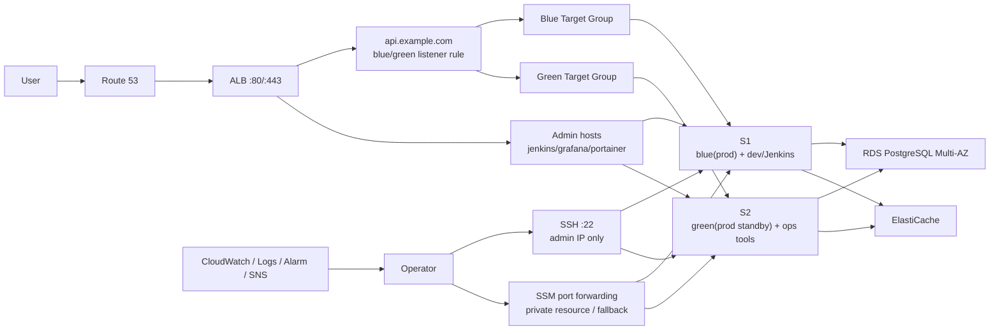
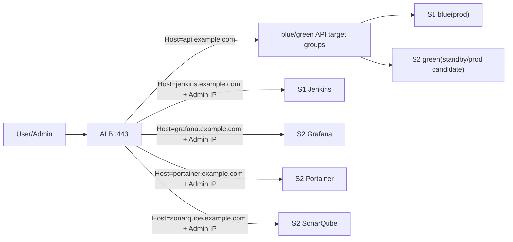

# 📋 AWS 인프라 설계안

> **작성일:** 2026-04-20  
> **작성자:** 유준호
> **최종 수정일:** 2026-04-20

---

## 1. 문서 목적

부산이음길 서비스의 AWS 인프라 구성을 현재 예산과 운영 방식에 맞게 정리한다.  
현재는 **EC2 2대 운영**을 기준으로 설계하고, 이후 **EC2 1대를 추가하여 3대 구조로 확장**하는 방향을 함께 기록한다.

---

## 2. 현재 의사결정 요약

- 현재 운영 기준은 **EC2 2대**다.
- `dev`와 `Jenkins`는 **항상 켜져 있어야 한다**.
- 현재 2대 구조에서는 `S1`에 `blue(prod) + dev/Jenkins`, `S2`에 `green(prod standby) + 운영도구`를 둔다.
- `S2`에는 `Grafana`, `Portainer`, `SonarQube`, `PLG` 같은 운영도구를 둔다. 단, `green`이 실제 prod를 받기 시작하면 운영도구는 중지 가능해야 한다.
- EC2에 실제로 올라가는 핵심 서비스는 **WAS**와 **GraphHopper runtime**이다.
- `RDS`, `ElastiCache`는 관리형 서비스로 운영하며 EC2 자원을 사용하지 않는다.
- EC2 shell 접속은 **SSH**를 기본으로 사용하되, `22`는 관리자 고정 IP에서만 허용한다.
- `RDS`, `ElastiCache` 같은 private managed resource 접근은 **AWS Systems Manager Session Manager(SSM) port forwarding**을 사용한다.
- `SSM`은 SSH 장애 시 복구 채널로도 유지한다.
- 서비스 API와 필요한 관리자 UI는 **ALB**를 통해 `80/443`에서 host-based routing한다.
- Blue/Green은 `ALB target group`과 health check를 기준으로 전환한다.
- EC2에서 외부에 직접 여는 포트는 `22`만 두며, 관리자 고정 IP에서만 허용한다.
- 1차 모니터링과 알람은 **CloudWatch 기반**으로 두고, `PLG`는 보조 조회 수단으로 사용한다.

---

## 3. 현재 2대 운영 아키텍처

### 운영 개념

- `S1`은 prod 외에 `dev`, `Jenkins`를 함께 운영하므로 자원 상한 관리가 필요하다.
- `S2`의 운영도구는 보조 시스템이며, `green` 승격 시 바로 내려도 되는 구조로 둔다.
- 평소에는 `Route 53 -> ALB -> blue target group -> S1` 경로로 운영한다.
- `S2`는 `green` 배포 검증 또는 `blue` 장애 시 failover 후보로 사용한다.
- `Jenkins`, `Grafana`, `Portainer`는 웹 접근이 필요할 수 있으나, 원 포트는 공개하지 않고 `ALB`의 `443` host routing과 접근 제한을 사용한다.
- ALB는 target health check로 unhealthy target을 자동 제외한다.
- 배포 promotion은 Jenkins/CodeDeploy 같은 배포 자동화가 ALB listener rule 또는 target group weight를 변경하는 방식으로 처리한다.

---

## 4. 서버별 역할

| 서버 | 역할 | 항상 실행 여부 | 비고 |
|---|---|---|---|
| `S1` | `blue(prod)`, `dev`, `Jenkins`, `GraphHopper runtime(serve only)` | 항상 실행 | 현재 핵심 운영 서버. Graph import/build는 제외 |
| `S2` | `green(prod standby)`, `GraphHopper runtime(serve only)`, `Grafana`, `Portainer`, `SonarQube`, `PLG` | 항상 실행 | 배포/장애 전환 후보. green 승격 시 운영도구는 중지 가능 |
| `RDS` | PostgreSQL 운영 DB | 항상 실행 | Multi-AZ |
| `ElastiCache` | 캐시 | 선택 | 필요 시 replica/Multi-AZ 검토 |

### 현재 S1 반영 상태 (2026-04-25)

- Docker Engine과 Docker Compose 설치 확인 완료
- `/home/ubuntu/e102/repo`에 `develop` 기준 저장소 clone
- `PostGIS`, `Redis`, `MinIO`, `backend` dev stack 실행 완료
- dev stack 포트는 외부 직접 노출 없이 `127.0.0.1` 바인딩
- Jenkins는 `https://k14e102.p.ssafy.io/jenkins/` 경로로 접근 가능
- S1 dev backend는 nginx 443 proxy의 `/api/` 경로로 접근 가능
- PostgreSQL은 외부 공개하지 않으며 `/db` 경로도 만들지 않음
- Jenkins GitLab OAuth와 Matrix 권한 적용
- Jenkins `e102-dev-deploy` 잡에서 `develop` 배포 및 `/v3/api-docs` smoke test 성공
- Jenkins `.env.dev`는 `e102-dev-env-file` credential로 관리
- Jenkins Poll SCM `H/30 * * * *`로 30분마다 `develop` 변경 여부 확인
- Jenkins GitLab Push Hook 수신 endpoint 검증 완료. GitLab 프로젝트 hook 등록은 Maintainer 권한 필요
- Jenkins home volume은 S1 로컬 cron으로 매일 백업
- `Grafana`, `Portainer`, `SonarQube`, `PLG`는 `S2` 배치 예정으로 `S1`에는 설치하지 않음

### S1 상세

- `blue(prod)` 애플리케이션 실행
- `dev` 환경 상시 실행
- `Jenkins` 상시 실행
- `GraphHopper runtime(serve only)` 실행
- `GraphHopper import/build` 작업은 포함하지 않음

### S2 상세

- `green(prod standby)` 애플리케이션 실행
- `GraphHopper runtime(serve only)` 실행
- `GraphHopper import/build` 작업은 포함하지 않음
- `Grafana`, `Portainer`, `SonarQube`, `PLG` 스택 실행 가능
- 장애/배포 전환 시 `green`이 실제 prod를 받으면 운영도구는 중지 가능해야 함

---

## 5. 네트워크 구성

### 기본 방향

- 예산을 고려해 **ALB와 App EC2는 public 영역**에 둔다.
- 대신 보안그룹으로 접근을 강하게 제한한다.
- `RDS`, `ElastiCache`는 **private subnet**에 둔다.
- EC2 shell 접속은 `SSH`로 진행하되 `22`는 관리자 고정 IP만 허용한다.
- private resource 접근은 `SSM port forwarding`을 사용한다.
- Jenkins, Grafana, Portainer의 원 포트는 외부에 직접 열지 않는다.

### 권장 배치

| 구역 | 리소스 |
|---|---|
| Public Subnet A/C | `ALB`, `S1`, `S2` |
| Private Subnet A/C | `RDS`, `ElastiCache` |

### 보안그룹 원칙

- `ALB SG`
  - `80/443`은 Internet에서 허용
- `App SG`
  - `22`는 관리자 고정 IP에서만 허용
  - WAS, GraphHopper, Jenkins, Grafana, Portainer 원 포트는 Internet에서 직접 허용하지 않음
  - WAS, Jenkins, Grafana, Portainer 대상 포트는 필요한 경우 `ALB SG`에서만 허용
  - GraphHopper는 백엔드/운영 대상 SG에서만 허용
- `RDS SG`
  - `5432`는 `App SG`에서만 허용
- `ElastiCache SG`
  - 캐시 포트는 `App SG`에서만 허용

### 비고

- App EC2를 private subnet으로 옮기면 구조는 더 깔끔해진다.
- 하지만 현재 예산에서는 `NAT Gateway` 비용이 부담될 수 있으므로 우선 public EC2 + ALB + SG 제한 구조를 채택한다.
- 운영 안정화 후 관리자 UI는 VPN 또는 SSM/SSH 터널 뒤로 이동하는 것을 검토한다.

---

## 6. 애플리케이션 배치 원칙

### EC2에 올리는 것

- `WAS`
- `GraphHopper runtime`
- `dev`
- `Jenkins`(S1)
- `Grafana`, `Portainer`, `SonarQube`, `PLG`(S2 운영도구)

### EC2에 올리지 않는 것

- 모바일 앱
- 운영 DB
- 운영 캐시
- Graph build/import 무거운 작업

### GraphHopper 운영 원칙

- `GraphHopper import/build` 작업은 prod 서버에서 직접 수행하지 않는다.
- 그래프 생성은 `Jenkins` 또는 별도 배치 작업에서 수행하고, 결과 아티팩트를 prod 서버에 배포한다.
- prod 서버는 **GraphHopper runtime 조회만 담당**한다.

이 원칙을 지키면 EC2 자원 사용량을 `WAS + GraphHopper serve` 수준으로 제한할 수 있다.

---

## 7. 배포 전략

### 현재 2대 기준

1. `green(S2)`에 신규 버전 배포
2. ALB target health check 및 smoke test 수행
3. 배포 자동화가 ALB listener rule 또는 target group weight를 `green(S2)`으로 전환
4. 안정화 후 기존 `blue` 갱신

### 주의사항

- 현재 구조는 완전한 대칭형 `blue/green`이라기보다 **warm standby 기반 타협안**이다.
- `S1`에는 `dev/Jenkins`가 함께 있으므로 `blue`와 `green`의 자원 상태가 완전히 대칭적이지 않다.
- ALB health check는 unhealthy target을 자동 제외하지만, 새 버전 promotion 자체는 배포 자동화가 listener/weight를 변경해야 한다.
- 장애 전환 절차는 `Jenkins`에만 의존하면 안 된다. `S1` 장애 시 `Jenkins`도 같이 죽기 때문이다.
- 자동 전환은 아래 두 층으로 나누어 본다.
  - target 장애 제외: ALB health check가 unhealthy target을 자동 제외한다.
  - 배포 promotion: Jenkins/CodeDeploy가 ALB listener rule 또는 target group weight를 자동 변경한다.
- 배포 자동화 실패나 긴급 장애 상황에 대비해 수동 runbook은 fallback으로 유지한다.
- 최종 목표는 Jenkins/CodeDeploy 같은 배포 자동화를 통해 ALB target group 전환을 자동화하는 것이다.

---

## 8. 모니터링 전략

### 1차 모니터링

운영 핵심 알람은 **CloudWatch + CloudWatch Logs + Alarm + SNS/Slack** 으로 둔다.

이유:

- EC2 바깥 AWS 관리 평면에서 동작하므로 서버 장애 시에도 알람이 살아 있다.
- `S1`이나 `S2`가 죽어도 `ALB`, `RDS`, `EC2`, `ElastiCache` 상태를 볼 수 있다.

### 2차 모니터링

`Grafana`, `Portainer`, `SonarQube`, `PLG` 스택은 `S2`에 둔다.

전제:

- 운영도구는 보조 시각화/조회/품질관리 용도다.
- `green`이 실제 prod로 승격되면 운영도구는 중지 가능해야 한다.
- 운영도구는 컨테이너로 올리고 CPU/메모리 제한을 둔다.

### 우선 모니터링 대상

- `ALB`
  - `HealthyHostCount`
  - `HTTPCode_ELB_5XX_Count`
  - `HTTPCode_Target_5XX_Count`
  - `TargetResponseTime`
- `EC2`
  - CPU
  - Memory
  - Disk usage
  - Network
- `WAS/JVM`
  - Heap usage
  - GC pause
  - Thread pool
- `GraphHopper`
  - 응답 지연
  - OOM 여부
  - 프로세스 상태
- `RDS`
  - CPU
  - Connections
  - Free storage
  - Latency
- `ElastiCache`
  - Memory
  - CPU
  - Evictions
- `Jenkins`
  - Queue length
  - Build failure
  - Disk usage
- `Portainer`
  - 컨테이너 상태
  - 관리 UI 접근 로그
  - Docker host disk usage

---

## 9. 도메인 및 라우팅 정책

초기 구조에서는 `ALB` 하나로 `서비스 API`와 필요한 `관리자 UI`를 함께 라우팅한다.
이때 같은 도메인 경로 기반(`service-domain/jenkins`, `service-domain/grafana`)보다 **서브도메인 기반 host routing**을 우선 채택한다.

관리자 UI는 웹 접근 편의를 위해 `443`으로 노출하지만, 원 포트는 열지 않는다.
따라서 `jenkins.example.com`, `grafana.example.com`, `portainer.example.com`은 반드시 ALB listener rule의 source IP 조건, WAF, 또는 인증 연동을 전제로 한다.

### 권장 도메인 구조

| 용도 | 권장 도메인 | 대상 |
|---|---|---|
| 서비스 API | `api.example.com` | `ALB -> blue/green target groups` |
| Jenkins | `jenkins.example.com` | `ALB -> S1 Jenkins target group` |
| Grafana | `grafana.example.com` | `ALB -> S2 Grafana target group` |
| Portainer | `portainer.example.com` | `ALB -> S2 Portainer target group` |
| SonarQube | `sonarqube.example.com` | `ALB -> S2 SonarQube target group` |

### 권장 이유

- `ALB`의 host-header rule로 단순하게 분리 가능하다.
- `Jenkins`, `Grafana`, `Portainer`를 경로 기반(`/jenkins`, `/grafana`, `/portainer`)으로 둘 때 필요한 context path 설정 복잡도를 피할 수 있다.
- 관리 UI 원 포트를 외부에 직접 노출하지 않고 `443` 하나로 접근할 수 있다.
- 이후 VPN 또는 별도 관리 서버를 도입하더라도 DNS와 target group만 조정하면 된다.

### ALB 라우팅 예시

### 운영 주의사항

- `Jenkins`, `Grafana`, `Portainer`는 일반 사용자 공개 서비스가 아니므로 관리자 접근만 허용한다.
- 관리자 UI는 `ALB`로 웹 접근이 가능하더라도 public service가 아니라 admin service로 취급한다.
- `Jenkins`, `Grafana`, `Portainer` 원 포트는 Internet에서 직접 접근할 수 없어야 한다.
- `S2`가 `green standby`이면서 동시에 운영도구를 운영하면 장애 전환 시 자원 충돌 가능성이 있다.
- `green`이 실제 prod를 받기 시작하면 `PLG`는 중지 또는 제한 가능해야 한다.
- 장기적으로는 관리자 UI를 VPN 또는 SSM/SSH 터널 뒤로 이동하는 것을 검토한다.

### 비권장 대안

아래 방식도 기술적으로는 가능하지만 현재는 우선 채택하지 않는다.

- `example.com/jenkins/*`
- `example.com/grafana/*`
- `example.com/portainer/*`

비권장 이유:

- Jenkins, Grafana, Portainer의 context path 설정이 필요하다.
- 로그인 리다이렉트, 정적 파일 경로, 쿠키 경로 이슈가 생길 수 있다.
- 운영 난이도가 host-based routing보다 높다.

---

## 10. 장애 시나리오

### 9.1 `S1` 장애

- 영향
- `blue(prod)` 중단
- `dev/Jenkins` 중단
- 대응
  - `green(S2)` 서비스 상태 확인
  - `ALB`가 unhealthy target을 제외하거나 배포/장애 자동화가 green target group으로 전환
  - `S2` 운영도구는 필요 시 중단

### 9.2 `S2` 장애

- 영향
  - `green standby` 사용 불가
  - `Grafana/Portainer/SonarQube/PLG` 중단
- 대응
  - `S1 blue`로 계속 서비스
  - 배포 시 green 경로는 복구 후 사용

### 9.3 DB 장애

- `RDS Multi-AZ` failover에 의존

### 9.4 캐시 장애

- 캐시가 replica 없이 단일 노드라면 캐시는 SPOF가 될 수 있다.
- 캐시가 운영 필수 요소라면 replica/Multi-AZ를 검토한다.

---

## 11. 현재 구조의 장점과 한계

### 장점

- 2대만으로 시작 가능
- `dev`와 `Jenkins`를 항상 켜둘 수 있음
- `green` 기반 배포 검증 흐름을 미리 운영해볼 수 있음
- `ALB`로 `Jenkins`, `Grafana`, `Portainer`를 웹에서 접근 가능하게 만들 수 있음
- `RDS`, `ElastiCache`는 외부 노출 없이 `SSM port forwarding`으로 접근 가능
- 이후 3대 구조로 확장하기 쉬움

### 한계

- `S1`에 역할이 집중된다.
- `blue`와 `green`이 완전히 대칭적이지 않다.
- `S1` 장애 시 `prod 주 서버 + dev + Jenkins`가 함께 영향을 받는다.
- ALB가 살아 있더라도 `S1`에 있는 Jenkins는 `S1` 장애 시 사용할 수 없다.
- 관리자 UI를 `443`으로 접근 가능하게 두는 것은 편의성이 높지만, VPN/터널 방식보다 공격면이 넓다.
- `PLG`는 green 승격 시 희생 가능한 보조 시스템이어야 한다.

---

## 12. 향후 3대 확장 계획

향후 EC2를 1대 더 추가하면 아래 구조로 확장한다.

### 목표 구조

- `S1`: `blue(prod)`
- `S2`: `green(prod)`
- `S3`: `dev + Jenkins + PLG`

### 기대 효과

- `prod`와 `non-prod` 완전 분리
- `blue/green` 자원 대칭성 개선
- `Jenkins`와 `PLG`가 prod 노드 자원을 건드리지 않음
- 운영 안정성 상승

### 비고

- 이 문서에서 `S3`는 **AWS S3 버킷이 아니라 서버 3번**을 의미한다.

---

## 13. 추후 검증 항목

- `GraphHopper runtime`의 실제 메모리 사용량 측정
- `S1`에서 `blue + dev + Jenkins + GraphHopper` 동시 운영 시 자원 상한값 결정
- `PLG` 스택의 최소 사양 산정
- `green` 전환 runbook 문서화
- CloudWatch 필수 알람 세트 정의
- ALB listener rule, 관리자 IP 제한, TLS 인증서 발급/갱신 절차 정의
- Jenkins, Grafana, Portainer 관리자 계정/2FA/비밀번호 정책 정의
- `RDS`, `ElastiCache` 접속용 SSM port forwarding runbook 작성
- 향후 VPN 도입 시 관리자 UI 공개 범위 축소 검토

---

## 14. 최종 결론

현재는 아래 구조로 시작한다.

- `S1 = blue(prod) + dev/Jenkins`
- `S2 = green(prod standby) + Grafana/Portainer/SonarQube/PLG`
- `RDS = Multi-AZ`
- `ElastiCache = 필요 시 운영`
- `EC2 shell 접속 = SSH` 단, `22`는 관리자 고정 IP만 허용
- `private resource 접근 = SSM port forwarding`
- `Ingress = ALB`
- `외부 직접 노출 포트 = ALB 80/443, EC2 22` 단, `22`는 관리자 고정 IP만 허용
- `모니터링 1차 = CloudWatch`
- `모니터링 2차 = S2의 Grafana/PLG`
- `Jenkins`, `Grafana`, `Portainer`, `SonarQube`는 ALB의 **host-based routing**으로 웹 접근을 허용하되, 원 포트는 외부에 공개하지 않는다.

그리고 이후 서버 1대를 추가해 아래 구조로 확장한다.

- `S1 = blue(prod)`
- `S2 = green(prod)`
- `S3 = dev + Jenkins + PLG`

즉, **현재는 ALB 기반 2대 현실형 운영안**, **향후는 VPN을 포함한 3대 기반 정식 분리 구조**를 목표로 한다.
