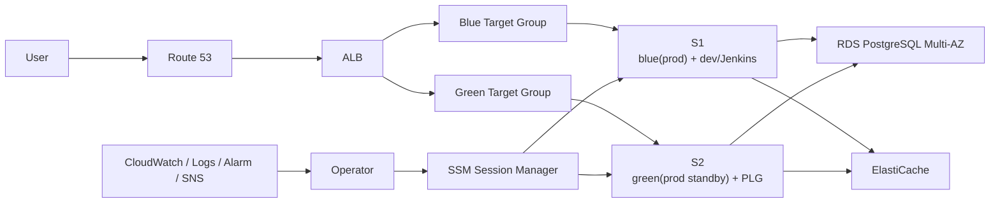
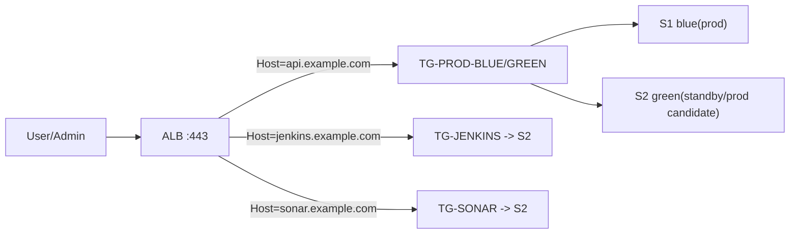

# 📋 AWS 인프라 설계안

> **작성일:** 2026-04-20  
> **작성자:** 유준호
> **최종 수정일:** 2026-04-20

---

## 1. 문서 목적

부산이음길 서비스의 AWS 인프라 구성을 현재 예산과 운영 방식에 맞게 정리한다.  
현재는 **EC2 2대 운영**을 기준으로 설계하고, 이후 **EC2 1대를 추가하여 3대 구조로 확장**하는 방향을 함께 기록한다.

---

## 2. 현재 의사결정 요약

- 현재 운영 기준은 **EC2 2대**다.
- `dev`와 `Jenkins`는 **항상 켜져 있어야 한다**.
- 현재 2대 구조에서는 `S1`에 `blue(prod) + dev/Jenkins`, `S2`에 `green(prod standby)`를 둔다.
- `S2`에는 보조 모니터링 용도로 `PLG` 스택을 둘 수 있다. 단, `green`이 실제 prod를 받기 시작하면 `PLG`는 중지 가능해야 한다.
- EC2에 실제로 올라가는 핵심 서비스는 **WAS**와 **GraphHopper runtime**이다.
- `RDS`, `ElastiCache`는 관리형 서비스로 운영하며 EC2 자원을 사용하지 않는다.
- 운영 접속은 `Bastion` 대신 **AWS Systems Manager Session Manager(SSM)** 를 사용한다.
- 1차 모니터링과 알람은 **CloudWatch 기반**으로 두고, `PLG`는 보조 조회 수단으로 사용한다.

---

## 3. 현재 2대 운영 아키텍처

### 운영 개념

- 평소에는 `ALB -> blue target group -> S1` 경로로 운영한다.
- `S2`는 `green` 배포 검증 또는 `blue` 장애 시 failover 용도로 사용한다.
- `S1`은 prod 외에 `dev`, `Jenkins`를 함께 운영하므로 자원 상한 관리가 필요하다.
- `S2`의 `PLG`는 보조 시스템이며, `green` 승격 시 바로 내려도 되는 구조로 둔다.

---

## 4. 서버별 역할

| 서버 | 역할 | 항상 실행 여부 | 비고 |
|---|---|---|---|
| `S1` | `blue(prod)`, `dev`, `Jenkins`, `GraphHopper runtime(serve only)` | 항상 실행 | 현재 핵심 운영 서버. Graph import/build는 제외 |
| `S2` | `green(prod standby)`, `GraphHopper runtime(serve only)`, `PLG` | 항상 실행 | 배포/장애 전환 후보. green 승격 시 `PLG`는 중지 가능 |
| `RDS` | PostgreSQL 운영 DB | 항상 실행 | Multi-AZ |
| `ElastiCache` | 캐시 | 선택 | 필요 시 replica/Multi-AZ 검토 |

### S1 상세

- `blue(prod)` 애플리케이션 실행
- `dev` 환경 상시 실행
- `Jenkins` 상시 실행
- `GraphHopper runtime(serve only)` 실행
- `GraphHopper import/build` 작업은 포함하지 않음

### S2 상세

- `green(prod standby)` 애플리케이션 실행
- `GraphHopper runtime(serve only)` 실행
- `GraphHopper import/build` 작업은 포함하지 않음
- `PLG` 스택 실행 가능
- 장애/배포 전환 시 `green`이 실제 prod를 받으면 `PLG`는 중지 가능해야 함

---

## 5. 네트워크 구성

### 기본 방향

- 예산을 고려해 **ALB와 App EC2는 public 영역**에 둔다.
- 대신 보안그룹으로 접근을 강하게 제한한다.
- `RDS`, `ElastiCache`는 **private subnet**에 둔다.
- 운영 접속은 `SSM`으로만 진행하고 `SSH 22`는 열지 않는다.

### 권장 배치

| 구역 | 리소스 |
|---|---|
| Public Subnet A/C | `ALB`, `S1`, `S2` |
| Private Subnet A/C | `RDS`, `ElastiCache` |

### 보안그룹 원칙

- `ALB SG`
  - `80/443` from Internet
- `App SG`
  - WAS 포트는 `ALB SG`에서만 허용
- `RDS SG`
  - `5432`는 `App SG`에서만 허용
- `ElastiCache SG`
  - 캐시 포트는 `App SG`에서만 허용

### 비고

- App EC2를 private subnet으로 옮기면 구조는 더 깔끔해진다.
- 하지만 현재 예산에서는 `NAT Gateway` 비용이 부담될 수 있으므로 우선 public+SG 제한 구조를 채택한다.

---

## 6. 애플리케이션 배치 원칙

### EC2에 올리는 것

- `WAS`
- `GraphHopper runtime`
- `dev`
- `Jenkins`
- `PLG`(S2 보조 운영용)

### EC2에 올리지 않는 것

- 모바일 앱
- 운영 DB
- 운영 캐시
- Graph build/import 무거운 작업

### GraphHopper 운영 원칙

- `GraphHopper import/build` 작업은 prod 서버에서 직접 수행하지 않는다.
- 그래프 생성은 `Jenkins` 또는 별도 배치 작업에서 수행하고, 결과 아티팩트를 prod 서버에 배포한다.
- prod 서버는 **GraphHopper runtime 조회만 담당**한다.

이 원칙을 지키면 EC2 자원 사용량을 `WAS + GraphHopper serve` 수준으로 제한할 수 있다.

---

## 7. 배포 전략

### 현재 2대 기준

1. `green(S2)`에 신규 버전 배포
2. health check 및 smoke test 수행
3. `ALB`를 `green`으로 전환
4. 안정화 후 기존 `blue` 갱신

### 주의사항

- 현재 구조는 완전한 대칭형 `blue/green`이라기보다 **warm standby 기반 타협안**이다.
- `S1`에는 `dev/Jenkins`가 함께 있으므로 `blue`와 `green`의 자원 상태가 완전히 대칭적이지 않다.
- 장애 전환 절차는 `Jenkins`에만 의존하면 안 된다.
  - `S1` 장애 시 `Jenkins`도 같이 죽기 때문이다.
- 전환 기준은 최소한 아래 중 하나를 가져간다.
  - 수동 runbook
  - CloudWatch Alarm 기반 수동 승인
  - 추후 Lambda/Automation 기반 반자동 전환

---

## 8. 모니터링 전략

### 1차 모니터링

운영 핵심 알람은 **CloudWatch + CloudWatch Logs + Alarm + SNS/Slack** 으로 둔다.

이유:

- EC2 바깥 AWS 관리 평면에서 동작하므로 서버 장애 시에도 알람이 살아 있다.
- `S1`이나 `S2`가 죽어도 `ALB`, `RDS`, `EC2`, `ElastiCache` 상태를 볼 수 있다.

### 2차 모니터링

`PLG` 스택은 `S2`에 둘 수 있다.

전제:

- `PLG`는 보조 시각화/조회 용도다.
- `green`이 실제 prod로 승격되면 `PLG`는 중지 가능해야 한다.
- `PLG`는 컨테이너로 올리고 CPU/메모리 제한을 둔다.

### 우선 모니터링 대상

- `ALB`
  - `HealthyHostCount`
  - `HTTPCode_ELB_5XX_Count`
  - `HTTPCode_Target_5XX_Count`
  - `TargetResponseTime`
- `EC2`
  - CPU
  - Memory
  - Disk usage
  - Network
- `WAS/JVM`
  - Heap usage
  - GC pause
  - Thread pool
- `GraphHopper`
  - 응답 지연
  - OOM 여부
  - 프로세스 상태
- `RDS`
  - CPU
  - Connections
  - Free storage
  - Latency
- `ElastiCache`
  - Memory
  - CPU
  - Evictions
- `Jenkins`
  - Queue length
  - Build failure
  - Disk usage

---

## 9. 도메인 및 라우팅 정책

현재 구조에서는 `ALB` 하나로 `서비스`, `Jenkins`, `SonarQube`를 함께 라우팅한다.  
이때 같은 도메인 경로 기반(`service-domain/jenkins`, `service-domain/sonar`)보다 **서브도메인 기반 host routing**을 우선 채택한다.

### 권장 도메인 구조

| 용도 | 권장 도메인 | 대상 |
|---|---|---|
| 서비스 API | `api.example.com` | `prod blue/green target group` |
| Jenkins | `jenkins.example.com` | `S2 Jenkins` |
| SonarQube | `sonar.example.com` | `S2 SonarQube` |

### 권장 이유

- `ALB`의 `host-header` rule로 단순하게 분리 가능하다.
- `Jenkins`, `SonarQube`를 경로 기반(`/jenkins`, `/sonar`)으로 둘 때 필요한 컨텍스트 패스 설정 복잡도를 피할 수 있다.
- 애플리케이션별 health check, target group, 접근 제어를 분리하기 쉽다.
- 이후 `Jenkins`, `SonarQube`를 별도 서버로 이동하더라도 DNS와 target group만 조정하면 된다.

### ALB 라우팅 예시

### 운영 주의사항

- `S2`가 `green standby`이면서 동시에 `Jenkins`, `SonarQube`를 운영하면 장애 전환 시 자원 충돌 가능성이 있다.
- 따라서 `Jenkins`, `SonarQube`는 컨테이너로 분리하고 CPU/메모리 상한을 둔다.
- `green`이 실제 prod를 받기 시작하면 `Jenkins`, `SonarQube`, `PLG`는 중지 또는 제한 가능해야 한다.
- `Jenkins`, `SonarQube`는 일반 사용자 공개 서비스가 아니므로 관리자 접근만 허용하는 보안 정책을 둔다.

### 비권장 대안

아래 방식도 기술적으로는 가능하지만 현재는 우선 채택하지 않는다.

- `example.com/jenkins/*`
- `example.com/sonar/*`

비권장 이유:

- Jenkins의 prefix 설정, SonarQube의 context path 설정이 필요하다.
- 로그인 리다이렉트, 정적 파일 경로, 쿠키 경로 이슈가 생길 수 있다.
- 운영 난이도가 host-based routing보다 높다.

---

## 10. 장애 시나리오

### 9.1 `S1` 장애

- 영향
  - `blue(prod)` 중단
  - `dev/Jenkins` 중단
- 대응
  - `ALB`를 `green(S2)`로 전환
  - `PLG`는 필요 시 중단

### 9.2 `S2` 장애

- 영향
  - `green standby` 사용 불가
  - `PLG` 중단
- 대응
  - `S1 blue`로 계속 서비스
  - 배포 시 green 경로는 복구 후 사용

### 9.3 DB 장애

- `RDS Multi-AZ` failover에 의존

### 9.4 캐시 장애

- 캐시가 replica 없이 단일 노드라면 캐시는 SPOF가 될 수 있다.
- 캐시가 운영 필수 요소라면 replica/Multi-AZ를 검토한다.

---

## 11. 현재 구조의 장점과 한계

### 장점

- 2대만으로 시작 가능
- `dev`와 `Jenkins`를 항상 켜둘 수 있음
- `green` 기반 배포 검증 흐름을 미리 운영해볼 수 있음
- 이후 3대 구조로 확장하기 쉬움

### 한계

- `S1`에 역할이 집중된다.
- `blue`와 `green`이 완전히 대칭적이지 않다.
- `S1` 장애 시 `prod 주 서버 + dev + Jenkins`가 함께 영향을 받는다.
- `PLG`는 green 승격 시 희생 가능한 보조 시스템이어야 한다.

---

## 12. 향후 3대 확장 계획

향후 EC2를 1대 더 추가하면 아래 구조로 확장한다.

### 목표 구조

- `S1`: `blue(prod)`
- `S2`: `green(prod)`
- `S3`: `dev + Jenkins + PLG`

### 기대 효과

- `prod`와 `non-prod` 완전 분리
- `blue/green` 자원 대칭성 개선
- `Jenkins`와 `PLG`가 prod 노드 자원을 건드리지 않음
- 운영 안정성 상승

### 비고

- 이 문서에서 `S3`는 **AWS S3 버킷이 아니라 서버 3번**을 의미한다.

---

## 13. 추후 검증 항목

- `GraphHopper runtime`의 실제 메모리 사용량 측정
- `S1`에서 `blue + dev + Jenkins + GraphHopper` 동시 운영 시 자원 상한값 결정
- `PLG` 스택의 최소 사양 산정
- `green` 전환 runbook 문서화
- CloudWatch 필수 알람 세트 정의

---

## 14. 최종 결론

현재는 아래 구조로 시작한다.

- `S1 = blue(prod) + dev/Jenkins`
- `S2 = green(prod standby) + PLG`
- `RDS = Multi-AZ`
- `ElastiCache = 필요 시 운영`
- `모니터링 1차 = CloudWatch`
- `모니터링 2차 = S2의 PLG`
- `Jenkins`, `SonarQube`는 ALB의 **host-based routing**으로 `S2`에 연결하는 방향을 우선 검토한다.

그리고 이후 서버 1대를 추가해 아래 구조로 확장한다.

- `S1 = blue(prod)`
- `S2 = green(prod)`
- `S3 = dev + Jenkins + PLG`

즉, **현재는 2대 기반 현실형 운영안**, **향후는 3대 기반 정식 분리 구조**를 목표로 한다.
