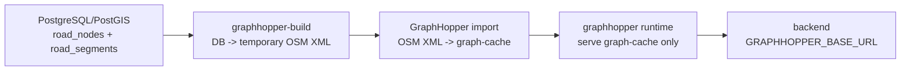

# GraphHopper DB LineString build/deploy runbook

> 작성일: 2026-05-06
> 기준 이슈: `S14P31E102-547`
> 기준 문서: `Docs/ERD/ERD_v4.md`, `Docs/API/길안내_도메인/2026-05-06_경로_API_명세.md`

## 1. 운영 원칙

GraphHopper의 운영 원천은 파일이 아니라 PostgreSQL/PostGIS의 보행 네트워크 테이블이다.

- 원천 DB: `road_nodes`, `road_segments`
- 핵심 geometry: `road_segments.geom GEOMETRY(LINESTRING, 4326)`
- 배포 산출물: GraphHopper `graph-cache`
- runtime 역할: 생성된 `graph-cache` serve only

`busan.osm.pbf`, `GRAPHHOPPER_DATA_FILE`, `GRAPHHOPPER_DATA_DIR`는 운영 필수 입력으로 사용하지 않는다. build job 내부에서 임시 OSM XML을 만들 수 있지만, 이 파일은 graph-cache 생성을 위한 중간 산출물일 뿐이다.

## 2. 데이터 흐름



## 3. build job

local:

```bash
make graphhopper-local-build
make local-up
```

dev:

```bash
make graphhopper-dev-build
make dev-up
```

prod:

```bash
make graphhopper-prod-build
make prod-up-graphhopper
```

직접 실행:

```bash
docker compose --env-file .env.prod \
  -f docker-compose.prod.yml \
  --profile graphhopper-build \
  run --rm graphhopper-build
```

### cache 호환성 규칙

- `graph-cache` 볼륨이 비어있지 않더라도, 현재 코드/설정 fingerprint와 다르면 재사용하지 않는다.
- 아래 입력이 바뀌면 fingerprint가 달라지고 dev/prod 배포는 graph-cache를 다시 생성한다.
  - `INF/graphhopper/Dockerfile`
  - `INF/graphhopper/config-build.yml`
  - `INF/graphhopper/config-runtime.yml`
  - `INF/graphhopper/custom_models/`
  - `INF/graphhopper/plugin/src/`
  - `scripts/graphhopper/export_postgis_to_osm.py`
- build 완료 후 runtime 볼륨 루트에 다음 메타 파일을 기록한다.
  - `.ieum-graphhopper-cache-fingerprint`
  - `.ieum-graphhopper-cache-built-at`
- 오래된 cache가 남아 있어도 fingerprint mismatch면 자동 rebuild가 우선이다.

## 4. 입력 변수

| 변수 | 설명 |
|---|---|
| `DB_URL` | `jdbc:postgresql://...` 형식의 DB URL |
| `DB_USERNAME` | DB 사용자 |
| `DB_PASSWORD` | DB 비밀번호 |
| `DB_SSLMODE` | prod RDS는 `require`, local/dev는 `prefer` 권장 |
| `GRAPHHOPPER_GRAPH_LOCATION` | runtime이 읽을 graph-cache 위치. 기본값 `/graphhopper/data` |
| `GRAPHHOPPER_IMPORT_TIMEOUT_SECONDS` | import 최대 대기 시간. 기본값 `1800` |
| `GRAPHHOPPER_ROAD_NODES_SQL` | 기본 `road_nodes` 조회 SQL override |
| `GRAPHHOPPER_ROAD_SEGMENTS_SQL` | 기본 `road_segments` 조회 SQL override |

기본 SQL은 ERD v4의 camelCase 컬럼명을 기준으로 한다. 실제 DB 스키마가 snake_case로 생성된 경우에는 `GRAPHHOPPER_ROAD_NODES_SQL`, `GRAPHHOPPER_ROAD_SEGMENTS_SQL`을 env로 override한다.

2026-05-06 develop 기준 ERD는 `Docs/ERD` 하위가 canonical이다. `route_sessions` 추가는 선택 경로 복구용 DB 계약이며, GraphHopper graph-cache build 입력은 여전히 `road_nodes`, `road_segments`다.

## 5. 실패 기준

build job은 아래 조건에서 실패해야 한다.

- DB 연결 실패
- `road_nodes` 조회 결과 0건
- `road_segments` 조회 결과 0건
- segment가 존재하지 않는 node를 참조
- GraphHopper import process가 health 상태에 도달하지 못함
- graph-cache 디렉터리가 비어 있음

runtime은 graph-cache가 비어 있으면 시작하지 않는다. 이 동작이 정상이다.

## 6. prod 배포

Jenkins prod pipeline은 `INF/jenkins/pipelines/e102-prod-deploy.Jenkinsfile`을 기준으로 한다.

- `BUILD_GRAPHHOPPER=true`: PostgreSQL에서 graph-cache를 새로 생성
- `DEPLOY_GRAPHHOPPER=true`: GraphHopper runtime까지 기동
- `ROLLBACK=true`: 이전 app image tag와 이전 graph-cache로 rollback

초기에는 `BUILD_GRAPHHOPPER=false`, `DEPLOY_GRAPHHOPPER=false`로 backend/AI prod 배포를 먼저 안정화한다. 경로 데이터가 DB에 준비되면 두 값을 켜서 GraphHopper를 포함한다.

## 7. smoke test

prod smoke test:

```bash
bash scripts/deploy/prod-smoke.sh
```

확인 대상:

- backend: `http://127.0.0.1:8080/v3/api-docs`
- AI: `http://127.0.0.1:5000/health`
- GraphHopper: `http://127.0.0.1:8990/healthcheck`

GraphHopper smoke는 `DEPLOY_GRAPHHOPPER=true`일 때만 실행한다.

길안내 API의 실제 route smoke는 `Docs/API/길안내_도메인/2026-05-06_경로_API_명세.md`의 `POST /routes/search/walk`, `POST /routes/search/transit` 구현이 완료된 뒤 추가한다.
