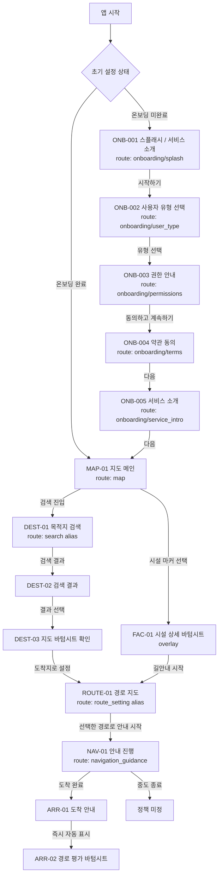
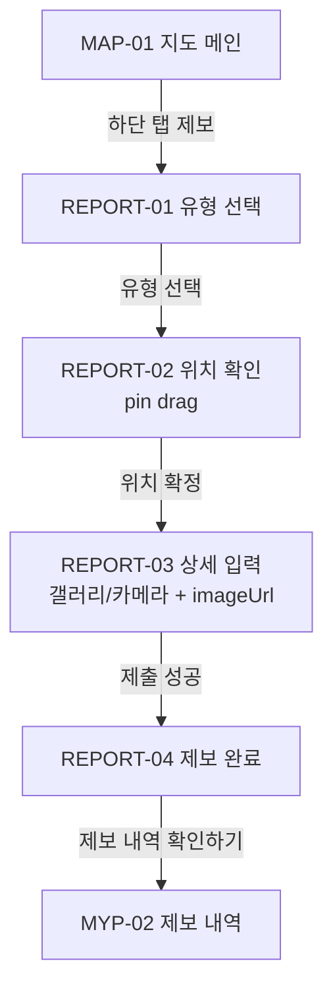
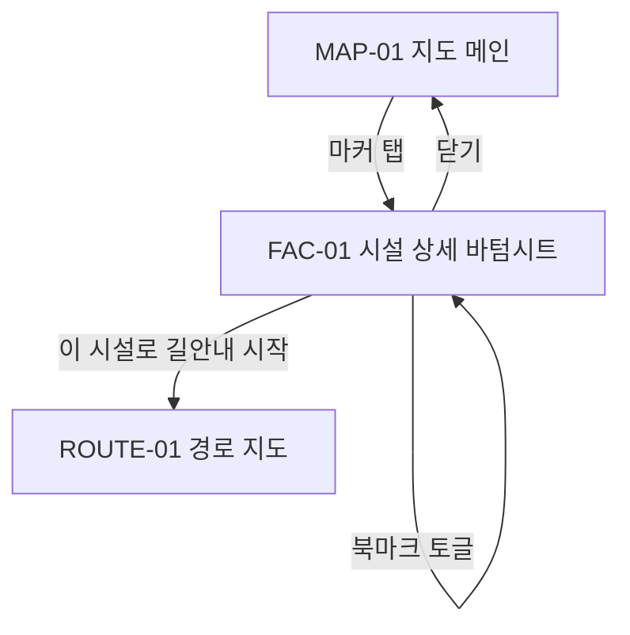
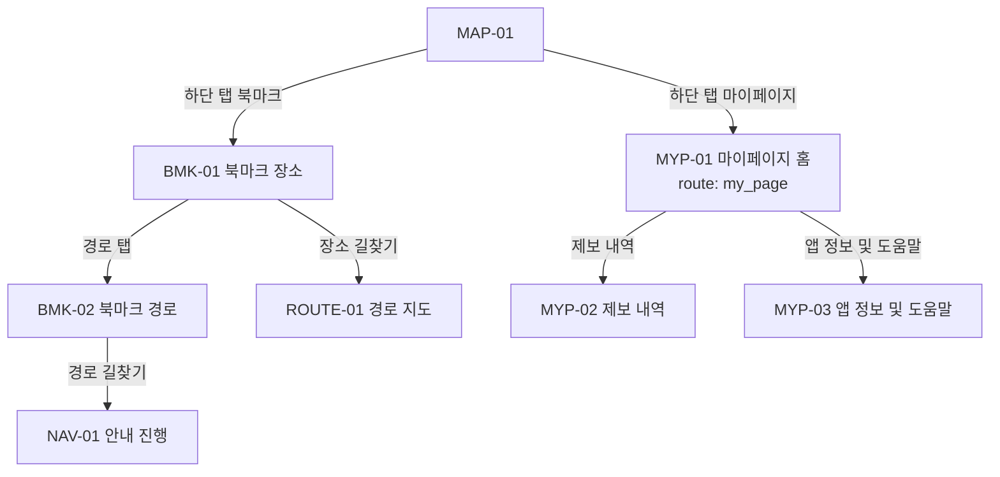
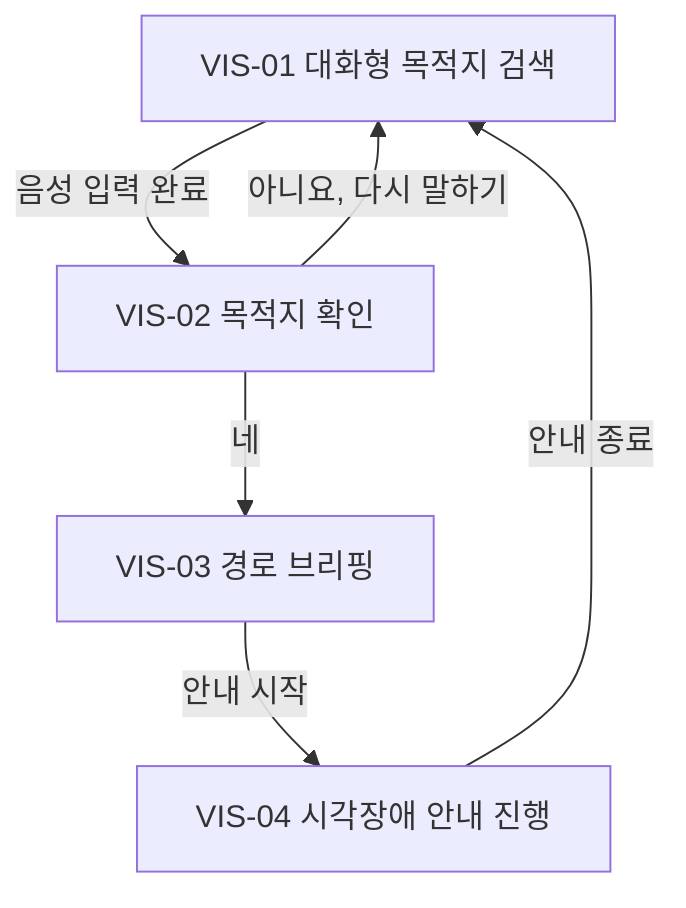

# 부산이음길 FE 화면 인벤토리 및 라우트 맵

- 작성일: 2026-04-22
- 대상: 부산이음길 Android FE 구현 / route 설계 / 화면 범위 고정
- 범위: 현재 워크스페이스의 `FE/app`, `FE/docs`, `FE/mockup`에서 확인 가능한 화면만 정리

## 1. 문서 개요

### 문서 목적

- FE 개발팀이 현재 기준에서 실제로 존재하는 화면 단위를 빠르게 파악할 수 있게 한다.
- `route`, `진입/이탈`, `상태`, `파라미터`, `공통 컴포넌트`를 기준으로 구현 착수용 IA를 고정한다.
- 바이브 코딩이나 AI 보조 구현 시 문서에 없는 화면을 임의로 만들지 않도록 화면 경계를 명시한다.

### 분석 기준

- 사용자 요청 우선순위를 그대로 적용했다.
  - 1순위: 팀 회의 결정인 `로그인 필수` 정책과 `FE/Docs/2026-04-27_로그인_필수_전환_FE_정합성_및_구현_영향.md`
  - 2순위: 신규 온보딩 디자인과 `FE/Docs/2026-04-27_온보딩_디자인_화면_구성_분석.md`
  - 3순위: 실제 코드에 존재하는 `screen / route / viewmodel / nav graph`
  - 4순위: `FE/Docs/2026-04-22_부산이음길_FE_디자인_컨벤션.md`
  - 5순위: `FE/Docs/2026-04-21_S14P31E102-211_공통_UI_접근성_Figma_handoff.md`
  - 6순위: `FE/Docs/2026-04-13_부산이음길_FE_컴포넌트_가이드.md`
  - 7순위: `FE/Docs/2026-04-13_부산이음길_FE_코드_컨벤션.md`
- `FE/mockup`은 화면 존재 여부, 화면 명칭, 단계 흐름, CTA를 보강하는 용도로 사용했다.
- 공공서비스형 지도 앱이라는 맥락을 반영해 `권한`, `오프라인`, `경로 실패`, `상태 전달`은 보수적으로 정리했다.
- 문서와 코드가 충돌하면 2026-04-27 확정 FE 문서 기준을 사용자 화면 ID의 우선 기준으로 둔다. 기존 코드 route key는 구현 alias로만 병기한다.

### 참고 자료

#### 코드 기준

- `FE/app/src/main/java/com/ssafy/e102/eumgil/app/navigation/Route.kt`
- `FE/app/src/main/java/com/ssafy/e102/eumgil/app/navigation/AppStartDestination.kt`
- `FE/app/src/main/java/com/ssafy/e102/eumgil/app/navigation/AppNavHost.kt`
- `FE/app/src/main/java/com/ssafy/e102/eumgil/app/navigation/OnboardingNavGraph.kt`
- `FE/app/src/main/java/com/ssafy/e102/eumgil/app/navigation/MainNavGraph.kt`
- `FE/app/src/main/java/com/ssafy/e102/eumgil/app/navigation/TopLevelDestination.kt`
- `FE/app/src/main/java/com/ssafy/e102/eumgil/feature/onboarding/*`
- `FE/app/src/main/java/com/ssafy/e102/eumgil/feature/map/*`
- `FE/app/src/main/java/com/ssafy/e102/eumgil/feature/search/*`
- `FE/app/src/main/java/com/ssafy/e102/eumgil/feature/route/*`
- `FE/app/src/main/java/com/ssafy/e102/eumgil/feature/navigation/*`
- `FE/app/src/main/java/com/ssafy/e102/eumgil/feature/report/*`
- `FE/app/src/main/java/com/ssafy/e102/eumgil/feature/mypage/*`
- `FE/app/src/main/java/com/ssafy/e102/eumgil/feature/savedroute/*`

#### 문서 기준

- `FE/Docs/2026-04-27_온보딩_디자인_화면_구성_분석.md`
- `FE/Docs/2026-04-27_로그인_필수_전환_FE_정합성_및_구현_영향.md`
- `FE/Docs/2026-04-22_부산이음길_FE_디자인_컨벤션.md`
- `FE/Docs/2026-04-21_S14P31E102-211_공통_UI_접근성_Figma_handoff.md`
- `FE/Docs/2026-04-13_부산이음길_FE_컴포넌트_가이드.md`
- `FE/Docs/2026-04-13_부산이음길_FE_코드_컨벤션.md`
- `FE/Docs/sprint_backlog/2026-04-21_S14P31E102-204_제보_작성_폼_state_spec.md`

#### 목업 기준

- `FE/mockup/E102_MVP_목업.html`
- `FE/mockup/E102_MVP_목업_scr006_접근성맵.html`
- `FE/mockup/E102_MVP_목업(길찾기).html`
- `FE/mockup/E102_MVP_목업(시각장애ui).html`
- `FE/mockup/E102_MVP_목업_scr010_장애물발견_제보플로우.html`
- `FE/mockup/E102_MVP_목업_scr010_장애물_우회안내.html`

### 표기 원칙

| 표기 | 의미 | 사용 기준 |
| --- | --- | --- |
| `관찰 사실` | 목업/문서에서 직접 확인 가능한 정보 | 화면명, CTA, visible flow, layout pattern |
| `코드 기준 확인` | 실제 코드에 존재하는 route, screen, state, event, parameter | `Route.kt`, `NavGraph`, `Contract`, `ViewModel`, `Screen` |
| `추정` | FE 구현상 필요하나 코드/목업에 직접 명시되지 않은 해석 | offline 상태, fallback 처리, 일부 데이터 타입 |
| `추가 결정 필요` | 현재 자료만으로 확정할 수 없는 항목 | 미구현 route, 구조 충돌, screen placement conflict |

## 2. 전체 화면 목록 요약

- 최신 기준 화면군은 `AUTH`, `ONB`, `MAP`, `DEST`, `ROUTE`, `NAV`, `ARR`, `BMK`, `REPORT`, `MYP`로 정리한다.
- 기존 코드 route와 다른 화면 ID는 최신 화면 ID를 우선하고, 코드 route key는 구현 alias로만 병기한다.
- 화면 ID 규칙 제안
  - 인증/프로필: `AUTH-###`
  - 온보딩: `ONB-###`
  - 지도/시설: `MAP-##`, `FAC-##`
  - 목적지 설정: `DEST-##`
  - 경로/길안내: `ROUTE-##`, `NAV-##`
  - 도착/평가: `ARR-##`
  - 북마크: `BMK-##`
  - 제보: `REPORT-##`
  - 마이페이지: `MYP-##`
  - 시각 지원 flow: `VIS-##`

| 화면 ID | 화면명 | 화면 유형 | 주요 목적 | 진입 방식 | 하단 탭 여부 | 주요 CTA | 구현 우선순위 | 비고 |
| --- | --- | --- | --- | --- | --- | --- | --- | --- |
| `AUTH-001` | 로그인 | 인증 | 소셜 로그인과 서비스 세션 생성 | 앱 실행 시 세션 없음 / 로그아웃 후 | N | 소셜 로그인 | `P0` | 로그인 필수 정책 기준, 디자인 추가 필요 |
| `AUTH-002` | 프로필 설정 / 회원가입 완료 | 인증/프로필 | 신규 사용자 필수 프로필 입력과 완료 처리 | `AUTH-001` 완료 후 `profileCompleted=false` | N | `완료` | `P0` | `PATCH /users/me` 기준, 필드 확정 필요 |
| `ONB-001` | 스플래시 / 서비스 소개 | 온보딩 | 서비스 정체성 전달 | 앱 최초 진입 | N | `시작하기` | `P0` | 신규 디자인 기준 |
| `ONB-002` | 사용자 유형 선택 | 온보딩 | 보행약자 이동 특성 선택 | `ONB-001` | N | 카드 선택 후 다음 단계 | `P0` | 상위 용어 `보행약자` |
| `ONB-003` | 권한 안내 | 설정/권한 | 권한 사전 설명 | `ONB-002` | N | `동의하고 계속하기` | `P0` | 위치 필수, 마이크는 STT 사용 시점 요청, 알림 후순위 |
| `ONB-004` | 약관 동의 | 설정/약관 | 필수 이용약관 동의 수집 | `ONB-003` | N | `다음` | `P0` | 약관 전문은 노션 웹뷰 |
| `ONB-005` | 서비스 소개 | 온보딩 | 핵심 기능 소개 후 메인 진입 | `ONB-004` | N | `다음` | `P0` | 3페이지 이상, 마지막 페이지에서 `MAP-01` |
| `MAP-01` | 지도 메인 | 검색/목적지 설정 | 탐색, 검색 진입, 시설 선택 | 인증/프로필/온보딩 완료 후 / 루트 탭 | Y | 검색 진입, 위치 권한 허용 | `P0` | 코드 기준 메인 landing, start gate 개정 필요 |
| `FAC-01` | 시설 상세 바텀시트 | 시설 | 시설 정보 확인, 북마크, 경로 진입 | `MAP-01` 마커 탭 | N | `이 시설로 길안내 시작` | `P1` | route 없음, overlay |
| `DEST-01` | 목적지 검색 및 최근 방문지 | 목적지 설정 | 검색어 입력, 최근 방문지 확인 | `MAP-01` 검색바 | Y | 검색 실행, 최근 방문지 선택 | `P0` | code route `search` alias |
| `DEST-02` | 검색 결과 선택 | 목적지 설정 | 장소 결과 비교와 후보 선택 | `DEST-01` 검색 실행 | Y | 결과 카드 선택 | `P0` | 결과 선택 후 항상 `DEST-03` |
| `DEST-03` | 지도 선택 / 목적지 상세 바텀시트 | 목적지 설정 | 선택 장소 확인 후 도착지 확정 | `DEST-02` 결과 선택 / 지도 선택 | Y | `도착지로 설정` | `P0` | 바로 경로 설정으로 가지 않음 |
| `DEST-04` | 사용자 상태 설문 | 목적지 설정 | 경로 추천용 세부 이동 특성 선택 | 조건부 진입 | Y | 상태 선택 | `P1` | 노출 조건 추가 확인 필요 |
| `ROUTE-01` | 경로 지도 / 경로 탐색 결과 | 경로 탐색 | 도보/대중교통 탭, 2개 옵션 선택 | `DEST-03`, `DEST-04`, `FAC-01` | N | `길 안내 시작` | `P0` | route `route_setting` alias |
| `ROUTE-02` | 경로 상세 정보 | 경로 탐색 | 선택 경로의 단계별 상세 확인 | `ROUTE-01` 화살표 버튼 | N | `길 안내 시작` | `P0` | 상세 진입은 옵션 카드 우측 상단 화살표 |
| `NAV-01` | 안내 진행 | 길 안내 | 진행 중 경로 안내와 종료 | `ROUTE-01` 시작 | N | `내비게이션 종료` | `P0` | route `navigation_guidance` |
| `ARR-01` | 도착 안내 / 경로 완료 | 도착 | 도착 완료와 후속 CTA 제공 | `NAV-01` 도착 완료 | Y | 홈, 새 경로 탐색 | `P0` | 진입 즉시 `ARR-02` 자동 표시 |
| `ARR-02` | 경로 평가 바텀시트 | 평가 | 별점 평가와 경로 저장 | `ARR-01` 자동 표시 | overlay | 평가 등록, X 닫기 | `P0` | 평가 저장 API 예정 |
| `BMK-01` | 북마크 / 장소 탭 | 북마크 | 북마크 장소 조회, 상세/길찾기 | 하단 탭 `북마크` | Y | 상세, 길찾기, 삭제 | `P1` | 편집은 삭제만 |
| `BMK-02` | 북마크 / 경로 탭 | 북마크 | 북마크 경로 조회, 상세/NAV-01 진입 | `BMK-01` 경로 탭 | Y | 상세, 길찾기, 삭제 | `P1` | 길찾기는 `NAV-01` 즉시 진입 |
| `REPORT-01` | 장애물 유형 선택 | 제보 | 8개 유형 중 선택 | 하단 탭 `제보` | Y | 유형 선택 | `P1` | API enum 후보 8개 |
| `REPORT-02` | 제보 위치 확인 | 제보 | pin drag로 위치 확정 | `REPORT-01` | Y | `다음` | `P1` | 사용자 계정 연결 |
| `REPORT-03` | 제보 상세 입력 | 제보 | 설명, 갤러리/카메라 사진 첨부 | `REPORT-02` | Y | `다음` | `P1` | imageUrl 선업로드 예정 |
| `REPORT-04` | 제보 완료 | 제보 | 완료 안내와 내역 연결 | `REPORT-03` | Y | `제보 내역 확인하기` | `P1` | `MYP-02` 연결, 처리 상태 미노출 |
| `MYP-01` | 마이페이지 홈 | 마이페이지 | 프로필, 배지, 메뉴, 계정 액션 | 하단 탭 `마이페이지` | Y | 사용자 유형 변경, 로그아웃 | `P1` | 사용자 유형 변경은 `ONB-002` |
| `MYP-02` | 제보 내역 | 마이페이지 | 내 제보 목록 확인 | `MYP-01`, `REPORT-04` | Y | 목록 선택 | `P1` | 처리 상태 미노출 |
| `MYP-03` | 앱 정보 및 도움말 | 마이페이지 | 이용 가이드, 정책 웹뷰, 계정 탈퇴 | `MYP-01` | Y | 웹뷰, 회원탈퇴 | `P1` | 고객센터/1:1 문의는 준비중 메시지 |
| `VIS-01` | 대화형 목적지 검색 | 검색/목적지 설정 | 시각장애 모드 음성 목적지 입력 | 진입점 미정 | N | `목적지 말하기` | `P2` | mockup-only |
| `VIS-02` | 목적지 확인 | 검색/목적지 설정 | 음성 인식 결과 확인 | `VIS-01` | N | `네`, `아니요, 다시 말하기` | `P2` | mockup-only |
| `VIS-03` | 경로 브리핑 | 경로 탐색 | 경로 요약 음성 브리핑 | `VIS-02` | N | `브리핑 듣기`, `안내 시작` | `P2` | mockup-only |
| `VIS-04` | 시각장애 안내 진행 | 길 안내 | 시각장애 모드 안내 진행 | `VIS-03` | N | `안내 종료` | `P2` | mockup-only |

## 3. 화면 인벤토리 상세

### `AUTH-001` 로그인

| 항목 | 내용 |
| --- | --- |
| 화면 ID | `AUTH-001` |
| 화면명 | 로그인 |
| route / route key | `auth/login` (`AuthRoute.Login`) |
| 목적 | 소셜 로그인으로 서비스 accessToken/refreshToken을 발급받고 인증 세션을 만든다. |
| 사용자가 이 화면에서 하는 일 | 제공자별 로그인 버튼 선택 |
| 진입 조건 | 저장된 인증 세션이 없거나 refreshToken 재발급 실패 |
| 진입 경로 | 앱 실행, 로그아웃 완료, 세션 만료 |
| 이탈 경로 | 로그인 성공 + `profileCompleted=false` -> `AUTH-002` 로그인 성공 + `profileCompleted=true` -> 온보딩 미완료 단계 또는 `MAP-01` |
| 상단 구조(App Bar 패턴) | 디자인 추가 필요 |
| 하단 구조 | 디자인 추가 필요. `비로그인으로 계속` CTA는 두지 않는다. |
| 핵심 컴포넌트 | `AuthSocialLoginButton`, `AuthErrorMessage`, `EumButton` 또는 provider 전용 버튼 |
| 필요한 데이터 | `socialProvider`, `socialAccessToken`, `authSession`, `profileCompleted` |
| 필요한 파라미터 | 없음 |
| 주요 상태 | `idle`, `loading`, `success`, `providerError`, `serverError`, `networkError` |
| 접근성/모드 차이 | 소셜 제공자명과 로그인 동작을 버튼 라벨로 명확히 전달한다. |
| 구현 메모 | 현재 코드에는 `AuthRoute`, `AuthNavGraph`, `feature/auth`, token store가 없다. |
| 근거 수준 | `팀 회의 로그인 필수 정책 + 인증 API 기준` |

### `AUTH-002` 프로필 설정 / 회원가입 완료

| 항목 | 내용 |
| --- | --- |
| 화면 ID | `AUTH-002` |
| 화면명 | 프로필 설정 / 회원가입 완료 |
| route / route key | `auth/profile_setup` (`AuthRoute.ProfileSetup`) |
| 목적 | 신규 사용자 또는 프로필 미완료 사용자의 필수 정보를 저장해 `profileCompleted=true` 상태로 전환한다. |
| 사용자가 이 화면에서 하는 일 | 필수 프로필 입력 후 완료 |
| 진입 조건 | 로그인 성공 응답 또는 `GET /users/me`에서 `profileCompleted=false` |
| 진입 경로 | `AUTH-001` |
| 이탈 경로 | 저장 성공 -> 온보딩 미완료 단계 또는 `MAP-01` |
| 상단 구조(App Bar 패턴) | 디자인 추가 필요 |
| 하단 구조 | 입력 완료 CTA `완료` |
| 핵심 컴포넌트 | `EumTextField`, `OnboardingUserTypeCard` 또는 profile 전용 선택 컴포넌트, `EumButton` |
| 필요한 데이터 | `nickname`, `disabilityType` 또는 `selectedUserType`, `disabilityGrade`, `phoneNumber` |
| 필요한 파라미터 | 없음 |
| 주요 상태 | `default`, `inputting`, `invalid`, `submitting`, `completed`, `error` |
| 접근성/모드 차이 | 필수 입력, 오류, 선택 상태를 TalkBack으로 전달한다. |
| 구현 메모 | API에는 `disabilityType`, `disabilityGrade`, `phoneNumber`가 있으나 최신 FE 문서 기준 상위 용어는 `보행약자`이며 세부 이동 특성 매핑은 별도 정리가 필요하다. |
| 근거 수준 | `팀 회의 로그인 필수 정책 + 사용자 정보 API 기준` |

### `ONB-001` 스플래시 / 서비스 소개

| 항목 | 내용 |
| --- | --- |
| 화면 ID | `ONB-001` |
| 화면명 | 스플래시 / 서비스 소개 |
| route / route key | `onboarding/splash` (`OnboardingRoute.Splash`) |
| 목적 | 부산이음길의 서비스명, 무장애 길찾기 목적, 부산 지역성을 첫 진입에서 전달한다. |
| 사용자가 이 화면에서 하는 일 | 서비스 소개 확인 후 `시작하기` 선택 |
| 진입 조건 | 인증 완료 + 프로필 완료 + `onboardingCompleted == false` |
| 진입 경로 | 앱 최초 실행 gate 통과 후 또는 온보딩 미완료 상태 |
| 이탈 경로 | `시작하기` -> `ONB-002` |
| 상단 구조(App Bar 패턴) | App Bar 없음. 상태바 아래 브랜드 중심 layout |
| 하단 구조 | 고정 Primary CTA `시작하기`, Bottom Navigation 없음 |
| 핵심 컴포넌트 | `OnboardingStepScaffold`, `OnboardingBrandHero`, `EumButton` |
| 필요한 데이터 | 없음 |
| 필요한 파라미터 | 없음 |
| 주요 상태 | `default`: 소개 표시 `completed`: 시작하기 선택 |
| 접근성/모드 차이 | 로고 이미지는 장식/브랜드 정보를 구분하고, 서비스명과 설명 텍스트가 먼저 읽히게 한다. |
| 구현 메모 | 기존 3단계 온보딩 코드에는 없는 신규 화면이다. 구현 개정 필요. |
| 근거 수준 | `신규 디자인 기준` |

### `ONB-002` 사용자 유형 선택

| 항목 | 내용 |
| --- | --- |
| 화면 ID | `ONB-002` |
| 화면명 | 사용자 유형 선택 |
| route / route key | `onboarding/user_type` (`OnboardingRoute.UserType`) |
| 목적 | 앱의 기본 이동 지원 기준을 `보행약자` 상위 용어와 세부 이동 특성으로 저장한다. |
| 사용자가 이 화면에서 하는 일 | 사용자 유형 카드 선택 |
| 진입 조건 | `ONB-001` 시작하기 선택 |
| 진입 경로 | `ONB-001` -> `ONB-002` |
| 이탈 경로 | 유형 선택 완료 -> `ONB-003` |
| 상단 구조(App Bar 패턴) | 진행률 + 제목 + 설명 |
| 하단 구조 | 디자인상 별도 하단 CTA는 보이지 않고 카드 선택이 다음 진행의 주 동작으로 관찰됨. 실제 CTA 유무는 `추가 확인 필요` |
| 핵심 컴포넌트 | `OnboardingStepScaffold`, `OnboardingUserTypeCard` |
| 필요한 데이터 | `selectedUserType` |
| 필요한 파라미터 | 없음 |
| 주요 상태 | `default`: 선택 전 또는 기본 선택 `completed`: 사용자 유형 선택 저장 |
| 접근성/모드 차이 | 선택 카드는 선택 여부를 `stateDescription`으로 전달한다. 카드 라벨은 `보행약자` 상위 용어와 `휠체어 사용자`, `기타 보행약자` 세부 이동 특성을 따른다. |
| 구현 메모 | 기존 `시각장애/보행약자`와 `장애 등급` 기반 라우트는 최신 디자인과 불일치한다. |
| 근거 수준 | `신규 디자인 기준` |

### `ONB-003` 권한 안내

| 항목 | 내용 |
| --- | --- |
| 화면 ID | `ONB-003` |
| 화면명 | 권한 안내 |
| route / route key | `onboarding/permissions` (`OnboardingRoute.Permissions`) |
| 목적 | OS 권한 요청 전에 위치, 마이크, 알림 권한이 필요한 이유와 필수/선택 여부를 설명한다. |
| 사용자가 이 화면에서 하는 일 | 권한 목록 확인 후 `동의하고 계속하기` 선택 |
| 진입 조건 | 사용자 유형 선택 완료 |
| 진입 경로 | `ONB-002` -> `ONB-003` |
| 이탈 경로 | `동의하고 계속하기` -> 권한 요청 또는 `ONB-004` |
| 상단 구조(App Bar 패턴) | 진행률 + 제목 + 설명 |
| 하단 구조 | 고정 Primary CTA `동의하고 계속하기` |
| 핵심 컴포넌트 | `OnboardingPermissionCard`, `PermissionRequiredBadge`, `EumButton` |
| 필요한 데이터 | `locationPermissionStatus`, `microphonePermissionStatus`, `notificationPermissionStatus` |
| 필요한 파라미터 | 없음 |
| 주요 상태 | `default`: 권한 설명 표시 `permission denied`: 필수 권한 거부 또는 제한 안내 `completed`: 권한 안내 확인 |
| 접근성/모드 차이 | 권한명, 필수/선택 여부, 제한되는 기능을 카드 단위로 함께 읽히게 한다. |
| 구현 메모 | OS 권한 요청을 카드 선택 시점에 할지 CTA 선택 시점에 할지는 `추가 확인 필요`다. |
| 근거 수준 | `신규 디자인 기준` |

### `ONB-004` 약관 동의

| 항목 | 내용 |
| --- | --- |
| 화면 ID | `ONB-004` |
| 화면명 | 약관 동의 |
| route / route key | `onboarding/terms` (`OnboardingRoute.Terms`) |
| 목적 | 서비스 이용을 위한 필수 약관 동의를 수집한다. |
| 사용자가 이 화면에서 하는 일 | 이용약관 확인, 개인정보 처리 안내 확인, 체크박스 동의, `다음` 선택 |
| 진입 조건 | 권한 안내 완료 |
| 진입 경로 | `ONB-003` -> `ONB-004` |
| 이탈 경로 | `다음` -> `ONB-005` |
| 상단 구조(App Bar 패턴) | 진행률 + 제목 |
| 하단 구조 | 고정 Primary CTA `다음`, 필수 약관 미동의 시 disabled |
| 핵심 컴포넌트 | `TermsAgreementCard`, `PrivacyNoticeCard`, `ConsentCheckbox`, `EumButton` |
| 필요한 데이터 | `termsAgreed` |
| 필요한 파라미터 | 없음 |
| 주요 상태 | `default`: 미동의 `completed`: 필수 약관 동의 완료 |
| 접근성/모드 차이 | 체크박스는 `동의함/동의하지 않음` 상태를 전달하고, `다음` 비활성 사유를 화면 텍스트로 제공한다. |
| 구현 메모 | 약관 전문을 별도 화면, 바텀시트, 웹뷰 중 어디에 둘지는 `추가 확인 필요`다. |
| 근거 수준 | `신규 디자인 기준` |

### `ONB-005` 서비스 소개

| 항목 | 내용 |
| --- | --- |
| 화면 ID | `ONB-005` |
| 화면명 | 서비스 소개 |
| route / route key | `onboarding/service_intro` (`OnboardingRoute.ServiceIntro`) |
| 목적 | 무장애 경로 안내, 음성 안내, 시민 제보 기반 정보 갱신을 소개하고 메인으로 진입시킨다. |
| 사용자가 이 화면에서 하는 일 | 핵심 기능 카드 확인 후 `다음` 선택 |
| 진입 조건 | 필수 약관 동의 완료 |
| 진입 경로 | `ONB-004` -> `ONB-005` |
| 이탈 경로 | 마지막 소개 페이지 `다음` -> `MAP-01` |
| 상단 구조(App Bar 패턴) | 진행률 + 제목 |
| 하단 구조 | 고정 Primary CTA `다음`, dot indicator |
| 핵심 컴포넌트 | `ServiceFeatureCard`, `PageIndicator`, `EumButton` |
| 필요한 데이터 | `serviceIntroPage`, `onboardingCompleted` |
| 필요한 파라미터 | 없음 |
| 주요 상태 | `default`: 소개 페이지 표시 `completed`: 온보딩 완료 저장 후 메인 이동 |
| 접근성/모드 차이 | 기능 카드의 아이콘 의미는 텍스트 제목과 설명으로 중복 제공한다. |
| 구현 메모 | 서비스 소개는 3페이지 이상으로 구성한다. |
| 근거 수준 | `신규 디자인 기준` |

### `MAP-01` 지도 메인

| 항목 | 내용 |
| --- | --- |
| 화면 ID | `MAP-01` |
| 화면명 | 지도 메인 |
| route / route key | `map` (`TopLevelRoute.Map.route`) |
| 목적 | 지도 탐색, DEST-01 진입, 위치 상태 확인, 시설 선택의 루트 화면 |
| 사용자가 이 화면에서 하는 일 | 검색바 탭, 접근성 필터 변경, STT 장소 검색, 위치 권한/재중심 액션, 마커 선택, 하단 4탭 이동 |
| 진입 조건 | 온보딩 완료 또는 루트 탭 진입 |
| 진입 경로 | 앱 시작 후 기본 landing, 하단 탭 `홈`, 길안내 종료 후 도착/복귀 흐름 |
| 이탈 경로 | `DEST-01`, `FAC-01`, `BMK-01`, `REPORT-01`, `MYP-01`, `ROUTE-01(시설 상세 경유)` |
| 상단 구조(App Bar 패턴) | 일반 App Bar 없음. `MapTopSearchBar` + `MapCategoryFilterBar` + `MapLocationStatusCard` 상단 overlay |
| 하단 구조 | 루트 탭 표시 시 `EumTopLevelTabBar`; 조건부 `FacilityDetailBottomSheetShell` bottom overlay |
| 핵심 컴포넌트 | `MapShellScaffold`, `MapViewport`, `MapTopSearchBar`, `MapCategoryFilterBar`, `MapLocationStatusCard`, `FacilityDetailBottomSheetShell` |
| 필요한 데이터 | `cameraTarget`, `selectedDestination`, `locationStatus`, `recenterButtonState`, `markerOverlayState`, `markerFilterState`, `facilityDetailSheetState` |
| 필요한 파라미터 | route param 없음. 대신 `selectedDestination: PlaceDestination?`를 `DestinationSelectionRepository`에서 구독 |
| 주요 상태 | `default`: 부산 중심 지도 shell `loading`: 위치 확인 중, 마커/필터 준비 중 `empty`: 마커 없음 / 필터 결과 없음 `error`: 마커 상태 오류 메시지 `permission denied`: 위치 권한 미허용 `completed`: 해당 없음 |
| 접근성/모드 차이 | 검색바와 위치 상태 카드에 a11y label이 따로 있음. 위치 제한/실패는 색상 외 텍스트로 구분됨. |
| 구현 메모 | 최신 기준 하단 탭은 `홈/북마크/제보/마이페이지` 4개다. 현재 코드의 과거 탭 구조는 구현 alias로만 본다. |
| 근거 수준 | `코드 기준 확인` + `관찰 사실` |

### `FAC-01` 시설 상세 바텀시트

| 항목 | 내용 |
| --- | --- |
| 화면 ID | `FAC-01` |
| 화면명 | 시설 상세 바텀시트 |
| route / route key | 별도 route 없음. `MAP-01` 내부 overlay |
| 목적 | 선택한 시설의 기본 정보, 접근성 태그, 북마크 상태, 길안내 진입 CTA 제공 |
| 사용자가 이 화면에서 하는 일 | 시설 정보 확인, 북마크 토글, 닫기, 길안내 시작 |
| 진입 조건 | 지도 마커 선택 |
| 진입 경로 | `MAP-01` marker tap |
| 이탈 경로 | 닫기 -> `MAP-01` 길안내 시작 -> `ROUTE-01` |
| 상단 구조(App Bar 패턴) | 별도 App Bar 없음. 바텀시트 shell 내부 제목/닫기 액션 |
| 하단 구조 | 시트 내부 bookmark 영역 + Primary CTA `이 시설로 길안내 시작` |
| 핵심 컴포넌트 | `FacilityDetailBottomSheetShell`, `FacilityDetailAccessibilityTagSection`, `FacilityDetailBookmarkSection`, 정보 카드 슬롯 |
| 필요한 데이터 | `MapFacilityDetailSheetState(detail, isBookmarked, isBookmarkUpdating, bookmarkErrorMessage)` |
| 필요한 파라미터 | 외부 route param 없음. 내부적으로 `selectedMarkerId` -> `FacilityDetailSeed` -> `PlaceDestination` 변환 |
| 주요 상태 | `default`: 상세 표시 `loading`: 북마크 업데이트 중 `empty`: 접근성 정보 준비 중 placeholder `error`: 북마크 오류 snackbar 메시지 `permission denied`: 해당 없음 `completed`: 길안내 handoff 후 시트 닫힘 |
| 접근성/모드 차이 | 태그와 CTA가 모두 텍스트 기반으로 제공돼 색상 단독 의존이 적다. |
| 구현 메모 | 상세 화면이 독립 route인지, 지도 전용 overlay로 고정할지는 현재 코드 기준 overlay 우선이다. |
| 근거 수준 | `코드 기준 확인` + `관찰 사실` |

### `DEST-01`~`DEST-03` 목적지 검색/선택

| 항목 | 내용 |
| --- | --- |
| 화면 ID | `DEST-01`, `DEST-02`, `DEST-03` |
| 화면명 | 목적지 검색 및 선택 |
| route / route key | `search` (`SearchRoute.Search.route`) |
| 목적 | 목적지를 검색하고, 결과 카드 선택 후 지도 바텀시트에서 최종 확인한다. |
| 사용자가 이 화면에서 하는 일 | 검색어 입력, STT 장소 검색, 최근 방문지 선택, 결과 목록 선택, 지도 바텀시트 확인 |
| 진입 조건 | 지도 검색 진입 클릭 |
| 진입 경로 | `MAP-01` 검색바 |
| 이탈 경로 | 뒤로가기 -> 이전 화면(`MAP-01`) 검색 결과 선택 -> `DEST-03` 도착지 확정 -> `ROUTE-01` 또는 `DEST-04` |
| 상단 구조(App Bar 패턴) | Text back button + 화면 제목 `목적지 설정` 또는 검색 입력 |
| 하단 구조 | 최신 디자인 기준 하단 4탭 유지 |
| 핵심 컴포넌트 | `SearchTopBar`, `OutlinedTextField`, 검색/지우기 버튼, 최근 검색 버튼 목록, 검색 결과 카드 목록 |
| 필요한 데이터 | `query`, `hasEditedQuery`, `recentSearches`, `resultState`, `selectedPlaceForBottomSheet` |
| 필요한 파라미터 | route param 없음. `DEST-03` 도착지 확정 시 `PlaceDestination` 객체를 `DestinationSelectionRepository`에 저장 |
| 주요 상태 | `default`: 초기 안내 `loading`: 검색 중 `empty`: 빈 검색어 / 결과 없음 `error`: 검색 실패 또는 invalid coordinate handoff `permission denied`: 마이크 STT 사용 시 권한 미허용 가능 `completed`: `DEST-03` 확인 후 route handoff |
| 접근성/모드 차이 | 결과 row는 `Role.Button`, `stateDescription`, 주소 포함/미포함 a11y label을 다르게 제공 |
| 구현 메모 | `DEST-01`~`DEST-04`는 별도 화면 ID 체계로 둔다. 현재 code route `search`는 `DEST-01/02` 구현 alias다. 결과 카드 선택은 바로 `ROUTE-01`로 가지 않고 항상 `DEST-03` 확인을 거친다. |
| 근거 수준 | `코드 기준 확인` + `관찰 사실` |

### `ROUTE-01` 경로 지도 / 경로 탐색 결과

| 항목 | 내용 |
| --- | --- |
| 화면 ID | `ROUTE-01` |
| 화면명 | 경로 지도 / 경로 탐색 결과 |
| route / route key | `route_setting` (`RouteSettingRoute.Setting.route`) |
| 목적 | 목적지 기준 도보/대중교통 경로와 2개 옵션을 비교하고, 선택한 경로로 길안내를 시작한다. |
| 사용자가 이 화면에서 하는 일 | 목적지/출발지 확인, 도보/대중교통 탭 전환, 옵션 선택, 상세 화살표 선택, 안내 시작 |
| 진입 조건 | `DEST-03` 도착지 확정 또는 시설 상세에서 목적지 handoff 완료. handoff 실패 시 fallback 목적지로 진입 |
| 진입 경로 | `DEST-03` 도착지 확정, `DEST-04` 사용자 상태 선택, `FAC-01` 길안내 시작 |
| 이탈 경로 | 뒤로가기 -> 이전 화면 안내 시작 -> `NAV-01` |
| 상단 구조(App Bar 패턴) | Text back button + 제목 `경로 지도` |
| 하단 구조 | 경로 옵션 바텀시트 + Primary CTA |
| 핵심 컴포넌트 | 목적지 카드, 출발/도착 waypoint 섹션, 도보/대중교통 탭, `RouteOptionCard` 2개 세로 목록, route summary 카드, CTA bar |
| 필요한 데이터 | `RouteSettingUiState` 전체, 특히 `destinationHandoffState`, `optionCards`, `selectedRoute`, `cta` |
| 필요한 파라미터 | route param 없음. inbound는 `DestinationSelectionRepository.selectedDestination: PlaceDestination?` |
| 주요 상태 | `default`: 목적지/옵션 표시 `loading`: route fixture/API 로딩 `empty`: 목적지 없음 또는 summary 없음 `error`: route load 실패 `permission denied`: 해당 없음 `completed`: CTA acknowledged 후 navigation request emit |
| 접근성/모드 차이 | 옵션 카드가 선택 여부/위험도/요약을 텍스트와 badge로 같이 노출. 옵션 카드 선택은 선택 상태 변경이며 상세 이동은 우측 상단 화살표 버튼이다. |
| 구현 메모 | handoff가 비정상일 때도 route를 깨지 않고 fallback 목적지로 유지한다. `DIRECT / EMPTY / INVALID_COORDINATE` 분기 고정 필요. 대중교통 탭은 MVP 포함이다. |
| 근거 수준 | `코드 기준 확인` + `관찰 사실` |

### `NAV-01` 안내 진행

| 항목 | 내용 |
| --- | --- |
| 화면 ID | `NAV-01` |
| 화면명 | 안내 진행 |
| route / route key | `navigation_guidance` (`NavigationRoute.Guidance.route`) |
| 목적 | route setting에서 선택한 경로를 안내 진행 shell로 표시하고 종료 액션을 제공한다. |
| 사용자가 이 화면에서 하는 일 | 현재 안내 확인, 거리/ETA 확인, 내비 종료 |
| 진입 조건 | `ROUTE-01`에서 `StartNavigationRequested` 발생 |
| 진입 경로 | `ROUTE-01` -> `NavigationViewModel.bindNavigationRequest(request)` -> route 이동 |
| 이탈 경로 | 도착 완료 -> `ARR-01` 중도 종료 -> 정책 미정 |
| 상단 구조(App Bar 패턴) | Text back button + 제목 `안내 진행` |
| 하단 구조 | `NavigationBottomBar`의 종료 CTA. Bottom Navigation 없음 |
| 핵심 컴포넌트 | `NavigationShellHeader`, `NavigationProgressOverview`, `NavigationMapShell`, `NavigationStepCard`, `NavigationBottomBar` |
| 필요한 데이터 | `screenState`, `mapPlaceholderDescription`, `stepCard`, `exitCta` |
| 필요한 파라미터 | route path param 없음. inbound는 `RouteNavigationRequest(origin, destination, selectedRoute, source)` |
| 주요 상태 | `default`: route bind 후 ready shell `loading`: `NavigationScreenState.Loading` `empty`: route segment 없음 `error`: 코드상 명시 없음, handoff 문서상 필요 `permission denied`: 해당 없음 `rerouting`: 경로 이탈 시 재검색/재탐색 `completed`: `ARR-01` 이동 |
| 접근성/모드 차이 | 진행 개요 카드와 step card가 텍스트 요약을 제공한다. 길안내는 공공 서비스 특성상 `audio/TTS/live announcement` 연결이 후속 작업이다. |
| 구현 메모 | 코드 상태는 `Loading / Ready / Empty`만 있고, 최신 문서 기준 도착 완료는 `ARR-01`로 이동한다. 경로 이탈은 재검색/재탐색 상태로 정리한다. |
| 근거 수준 | `코드 기준 확인` + `관찰 사실` + `추정` |

### `REPORT-01`~`REPORT-04` 장애물 제보

| 항목 | 내용 |
| --- | --- |
| 화면 ID | `REPORT-01`, `REPORT-02`, `REPORT-03`, `REPORT-04` |
| 화면명 | 장애물 제보 플로우 |
| route / route key | `report` (`ReportRoute.Report.route`) |
| 목적 | 사용자 계정과 연결된 제보를 유형 선택, 위치 확인, 상세 입력, 완료 단계로 제출한다. |
| 사용자가 이 화면에서 하는 일 | 8개 유형 중 선택, pin drag로 위치 확정, 갤러리/카메라 사진 첨부, 설명 입력, 제출, 제보 내역 확인 |
| 진입 조건 | 하단 탭 `제보` 선택 |
| 진입 경로 | `MAP-01` 또는 하단 탭 `제보` |
| 이탈 경로 | 뒤로가기 -> 이전 단계 제출 완료 -> `REPORT-04` `제보 내역 확인하기` -> `MYP-02` |
| 상단 구조(App Bar 패턴) | 단계별 Text back button + 제목 |
| 하단 구조 | 단계별 Primary CTA, 하단 4탭 유지 |
| 핵심 컴포넌트 | 제보 유형 카드, 지도 + pin drag, 위치 카드, 설명 textarea, 갤러리/카메라 첨부, 완료 요약 |
| 필요한 데이터 | `ReportUiState` 전체. 특히 `draftId`, `reportType`, `location`, `imageUrl`, `description`, `draftSaveState`, `outboxState`, `submitState` |
| 필요한 파라미터 | route param 없음. 내부 상태 식별자로 `draftId: String?`, 완료 event payload로 `outboxId: String?`, `reportId: Long?` 사용 |
| 주요 상태 | `default`: Editing `loading`: InitialLoading / Submitting `empty`: 해당 없음 `error`: Failure, 필드별 validation error `permission denied`: `LocationPermissionDenied` reason 존재 `completed`: `ReportScreenState.Completed` |
| 접근성/모드 차이 | 첫 오류 스크롤 이벤트, 접근성 안내 이벤트, 필드별 helper/error text 유지 |
| 구현 메모 | 제보 유형은 `공사/통제`, `계단/단차`, `경사 문제`, `엘리베이터 고장`, `점자블록 문제`, `유도블록 문제`, `시설 파손/노후`, `기타 장애물` 8개를 API enum 후보로 둔다. 사진은 imageUrl 선업로드 방식이며 실제 URL/API 상세는 추후 구현이다. 처리 상태는 노출하지 않는다. |
| 근거 수준 | `코드 기준 확인` + `관찰 사실` |

### `MYP-01` 마이페이지 홈

| 항목 | 내용 |
| --- | --- |
| 화면 ID | `MYP-01` |
| 화면명 | 마이페이지 홈 |
| route / route key | `my_page` (`TopLevelRoute.MyPage.route`) |
| 목적 | 프로필, 활동 배지, 제보 내역, 앱 정보/도움말, 로그아웃을 제공한다. 알림 설정은 MVP 제외 또는 후순위다. |
| 사용자가 이 화면에서 하는 일 | 사용자 유형 변경, 제보 내역 확인, 앱 정보 및 도움말 진입, 로그아웃 |
| 진입 조건 | 하단 탭 `마이페이지` 선택 |
| 진입 경로 | 하단 탭 `마이페이지` |
| 이탈 경로 | 사용자 유형 변경 -> `ONB-002` 제보 내역 -> `MYP-02` 앱 정보 및 도움말 -> `MYP-03` 로그아웃 -> `AUTH-001` |
| 상단 구조(App Bar 패턴) | 코드: `EumPlaceholderScaffold` 제목/설명 구조 목업: profile header 중심 |
| 하단 구조 | 하단 4탭 표시 |
| 핵심 컴포넌트 | 프로필 카드, 활동 배지, 메뉴 리스트, 계정 CTA |
| 필요한 데이터 | `MyPageUiState(isDebugSectionVisible, isRuntimeToggleEnabled, isForceMockEnabled)` |
| 필요한 파라미터 | 없음 |
| 주요 상태 | `default`: placeholder 또는 profile menu `loading`: 해당 없음 `empty`: 해당 없음 `error`: 해당 없음 `permission denied`: 해당 없음 `completed`: 해당 없음 |
| 접근성/모드 차이 | 현재 코드에는 실제 접근성 설정 목록이 없고 debug 영역만 존재한다. |
| 구현 메모 | `이용권 사용자`, `보행약자 모드` 데이터 매핑은 미정이다. 활동 배지 산정 기준도 미정이다. 로그아웃의 확인 다이얼로그, 토큰 삭제 범위, 온보딩/프로필 상태 유지 여부는 미정이다. |
| 근거 수준 | `코드 기준 확인` + `관찰 사실` |

### `BMK-01`/`BMK-02` 북마크

| 항목 | 내용 |
| --- | --- |
| 화면 ID | `BMK-01`, `BMK-02` |
| 화면명 | 북마크 / 장소 탭, 북마크 / 경로 탭 |
| route / route key | 현재 코드의 과거 북마크 route key는 구현 alias로만 취급 |
| 목적 | 북마크 장소 또는 북마크 경로 목록을 관리하고, 상세/길찾기 재진입 경로를 제공한다. |
| 사용자가 이 화면에서 하는 일 | 북마크 장소/경로 목록 확인, 카드 본문으로 상세 이동, `길찾기`, 편집 삭제 |
| 진입 조건 | 하단 탭 `북마크` 선택 |
| 진입 경로 | 하단 탭 `북마크` 또는 `ARR-02` 경로 저장 후 진입 |
| 이탈 경로 | 장소 길찾기 -> `ROUTE-01` 경로 길찾기 -> `NAV-01` 하단 탭 이동 |
| 상단 구조(App Bar 패턴) | back button + `북마크` title + `편집` |
| 하단 구조 | 하단 4탭 유지 |
| 핵심 컴포넌트 | 북마크 장소 카드, 북마크 경로 카드, `장소/경로` segmented control, 삭제 편집 모드 |
| 필요한 데이터 | 북마크 장소 목록 또는 북마크 경로 목록 |
| 필요한 파라미터 | 개별 항목 action에는 `placeId`, `routeId` 또는 북마크 row id 필요 |
| 주요 상태 | `default`: placeholder 또는 목록 표시 `loading`: `추정` 필요 `empty`: `추정` 필요 `error`: `추정` 필요 `permission denied`: 해당 없음 `completed`: 해당 없음 |
| 접근성/모드 차이 | 북마크 리스트는 장소명/경로명 + 주소/경로 메타 + 태그 + 액션의 텍스트 조합이 필요하다. |
| 구현 메모 | 편집 모드에서는 삭제 기능만 제공한다. 정렬, 전체 선택, 다중 선택은 제공하지 않는다. |
| 근거 수준 | `코드 기준 확인` + `관찰 사실` |

### `VIS-01` 대화형 목적지 검색

| 항목 | 내용 |
| --- | --- |
| 화면 ID | `VIS-01` |
| 화면명 | 대화형 목적지 검색 |
| route / route key | 코드 route 없음. `추정 route key: 추가 결정 필요` |
| 목적 | 시각장애 모드에서 voice-first로 목적지를 입력한다. |
| 사용자가 이 화면에서 하는 일 | 음성 버튼 탭 후 목적지 말하기 |
| 진입 조건 | 시각장애 모드 전용 진입점 필요 |
| 진입 경로 | 현재 목업만 존재. 실제 app 진입점 미확정 |
| 이탈 경로 | 목적지 인식 성공 -> `VIS-02` |
| 상단 구조(App Bar 패턴) | 일반 App Bar 없음. 큰 제목 중심 |
| 하단 구조 | 단일 큰 음성 버튼 |
| 핵심 컴포넌트 | large title, info text, voice CTA |
| 필요한 데이터 | 음성 transcript 또는 destination text |
| 필요한 파라미터 | 없음 |
| 주요 상태 | `default`: 목적지 입력 대기 `loading`: 관찰 없음 `empty`: 해당 없음 `error`: 관찰 없음 `permission denied`: 마이크 권한 상태 필요해 보이나 자료상 미명시 -> `추정` `completed`: 목적지 인식 성공 후 다음 단계 |
| 접근성/모드 차이 | 화면 전체가 keyboard / screen reader / voice-first 구조로 설계됨 |
| 구현 메모 | 현재 코드 onboarding의 `visual` 모드와 연결될 가능성이 높지만 독립 nav graph는 아직 없다. |
| 근거 수준 | `관찰 사실` + `추가 결정 필요` |

### `VIS-02` 목적지 확인

| 항목 | 내용 |
| --- | --- |
| 화면 ID | `VIS-02` |
| 화면명 | 목적지 확인 |
| route / route key | 코드 route 없음. `추정 route key: 추가 결정 필요` |
| 목적 | 음성 인식한 목적지가 맞는지 확인한다. |
| 사용자가 이 화면에서 하는 일 | `네`, `아니요, 다시 말하기` 선택 |
| 진입 조건 | `VIS-01`에서 음성 입력 완료 |
| 진입 경로 | `VIS-01` |
| 이탈 경로 | `네` -> `VIS-03` `아니요` -> `VIS-01` |
| 상단 구조(App Bar 패턴) | 큰 제목 중심 |
| 하단 구조 | 2버튼 구조 |
| 핵심 컴포넌트 | destination text, confirm / deny buttons |
| 필요한 데이터 | `destination: String` |
| 필요한 파라미터 | `destination` 텍스트 필요, 타입 `String` |
| 주요 상태 | `default`: 확인 대기 `loading`: 해당 없음 `empty`: 해당 없음 `error`: 관찰 없음 `permission denied`: 해당 없음 `completed`: 확인 완료 후 브리핑 진입 |
| 접근성/모드 차이 | 버튼 label과 aria-label이 구체적 문장으로 제공됨 |
| 구현 메모 | 확인 단계가 별도 screen인지 dialog인지 현재 자료상 screen으로만 관찰된다. |
| 근거 수준 | `관찰 사실` + `추가 결정 필요` |

### `VIS-03` 경로 브리핑

| 항목 | 내용 |
| --- | --- |
| 화면 ID | `VIS-03` |
| 화면명 | 경로 브리핑 |
| route / route key | 코드 route 없음. `추정 route key: 추가 결정 필요` |
| 목적 | 안내 시작 전 총 거리, 시간, 랜드마크, 회전 횟수 등의 음성 브리핑을 제공한다. |
| 사용자가 이 화면에서 하는 일 | 브리핑 재생/일시정지, 상세 경로 목록 진입, 안내 시작 |
| 진입 조건 | `VIS-02`에서 목적지 확인 |
| 진입 경로 | `VIS-02` |
| 이탈 경로 | `안내 시작` -> `VIS-04` `상세 경로 목록` -> 대상 화면 미확정 |
| 상단 구조(App Bar 패턴) | 큰 제목 + 요약 텍스트 |
| 하단 구조 | 최대 3개 CTA(`브리핑 듣기`, `상세 경로 목록`, `안내 시작`) |
| 핵심 컴포넌트 | summary text, play toggle, list CTA, start CTA |
| 필요한 데이터 | 거리, ETA, 랜드마크 요약, 회전 횟수, destination text |
| 필요한 파라미터 | route summary payload 필요. 현재 코드/route 구조 없음 -> `추가 결정 필요` |
| 주요 상태 | `default`: 브리핑 준비 `loading`: 관찰 없음 `empty`: 해당 없음 `error`: 관찰 없음 `permission denied`: 해당 없음 `completed`: 안내 시작 가능 |
| 접근성/모드 차이 | 브리핑 재생 상태가 버튼 label과 aria-label로 함께 바뀐다. |
| 구현 메모 | `상세 경로 목록` 버튼은 존재하지만 실제 대상 screen은 자료에서 확인되지 않는다. |
| 근거 수준 | `관찰 사실` + `추가 결정 필요` |

### `VIS-04` 시각장애 안내 진행

| 항목 | 내용 |
| --- | --- |
| 화면 ID | `VIS-04` |
| 화면명 | 시각장애 안내 진행 |
| route / route key | 코드 route 없음. `추정 route key: 추가 결정 필요` |
| 목적 | 시각장애 모드의 간결한 실시간 안내 진행 화면을 제공한다. |
| 사용자가 이 화면에서 하는 일 | 안내 상태 확인, `안내 종료` |
| 진입 조건 | `VIS-03` 안내 시작 |
| 진입 경로 | `VIS-03` |
| 이탈 경로 | `안내 종료` -> `VIS-01` |
| 상단 구조(App Bar 패턴) | 큰 제목 중심, 일반 top bar 없음 |
| 하단 구조 | 단일 `안내 종료` 버튼 |
| 핵심 컴포넌트 | large title, status text, stop CTA |
| 필요한 데이터 | destination, current guidance status |
| 필요한 파라미터 | route progress payload 필요 -> `추가 결정 필요` |
| 주요 상태 | `default`: 안내 중 `loading`: 관찰 없음 `empty`: 해당 없음 `error`: 관찰 없음 `permission denied`: 위치/TTS 권한 필요 가능성은 있으나 자료상 미명시 -> `추정` `completed`: 종료 시 초기 화면 복귀 |
| 접근성/모드 차이 | 텍스트 밀도를 낮추고 음성/단일 행동 중심으로 설계됨 |
| 구현 메모 | 현재 코드의 `NAV-01`과 별도 route로 분기할지, 같은 route의 visual variant로 둘지 결정이 필요하다. |
| 근거 수준 | `관찰 사실` + `추가 결정 필요` |

## 4. 라우트 맵

### 4.1 라우트 맵 표

| 출발 화면 | 이벤트/액션 | 도착 화면 | 조건 | 전달 파라미터 | 비고 |
| --- | --- | --- | --- | --- | --- |
| 앱 시작 | 초기 설정 검사 | `ONB-001` | `onboardingCompleted == false` | 없음 | 신규 디자인 기준 start destination |
| 앱 시작 | 초기 설정 검사 | `MAP-01` | onboarding 완료 | 없음 | start destination |
| `ONB-001` | `시작하기` | `ONB-002` | 항상 | 없음 | 신규 디자인 기준 |
| `ONB-002` | 사용자 유형 선택 | `ONB-003` | `selectedUserType` 저장 | `selectedUserType` | DataStore 저장 후보 |
| `ONB-003` | `동의하고 계속하기` | `ONB-004` | 권한 안내 확인 | 권한 상태 | OS 권한 요청 시점은 추가 확인 필요 |
| `ONB-004` | `다음` | `ONB-005` | 필수 약관 동의 | `termsAgreed` | 필수 약관 미동의 시 disabled |
| `ONB-005` | `다음` | `MAP-01` | 마지막 소개 페이지 | 없음 | onboarding stack clear, `onboardingCompleted = true` |
| `MAP-01` | 검색바 클릭 | `DEST-01` | 항상 | 없음 | code route `search` alias |
| `MAP-01` | 마커 탭 | `FAC-01` | 해당 marker detail 존재 | 내부 `markerId` | overlay |
| `FAC-01` | 닫기 | `MAP-01` | 항상 | 없음 | overlay dismiss |
| `FAC-01` | `이 시설로 길안내 시작` | `ROUTE-01` | detail -> `PlaceDestination` 변환 성공 | `PlaceDestination` | repository handoff |
| `DEST-01` | 뒤로가기 | 이전 화면 | 항상 | 없음 | 현재 사용상 `MAP-01` |
| `DEST-01` | 검색어 입력 또는 검색 실행 | `DEST-02` | 검색어 존재 | query | 검색 결과 표시 |
| `DEST-02` | 검색 결과 선택 | `DEST-03` | 좌표 유효 | `PlaceDestination` | 지도 바텀시트 확인 |
| `DEST-02` | 검색 결과 선택 | `DEST-02` 오류 상태 | 좌표 무효 | 없음 | invalid handoff error |
| `DEST-03` | 도착지로 설정 | `ROUTE-01` 또는 `DEST-04` | 사용자 상태 설문 필요 여부 | `PlaceDestination` | 설문 노출 조건은 추가 확인 필요 |
| `ROUTE-01` | 뒤로가기 | 이전 화면 | 항상 | 없음 | `popBackStack()` |
| `ROUTE-01` | `선택한 경로로 안내 시작` | `NAV-01` | `destinationHandoffState == DIRECT` and selectedRoute 존재 | `RouteNavigationRequest` | shared ViewModel handoff |
| `NAV-01` | 뒤로가기 | 이전 화면 | 항상 | 없음 | 현재 구조상 `popBackStack()` |
| `NAV-01` | `내비게이션 종료` | `MAP-01` | exit CTA enabled | 없음 | code route |
| `NAV-01` | 도착 완료 | `ARR-01` | 목적지 도착 | route 상태 값 | `ARR-02` 즉시 자동 표시 |
| `MAP-01` | 하단 탭 `북마크` | `BMK-01` | 항상 | 없음 | 마지막 선택 탭 유지 가능 |
| `MAP-01` | 하단 탭 `마이페이지` | `MYP-01` | 항상 | 없음 | top-level route |
| `BMK-01` | 경로 탭 선택 | `BMK-02` | 항상 | 없음 | segmented control |
| `BMK-01` | 장소 `길찾기` | `ROUTE-01` | 장소 데이터 존재 | `PlaceDestination` | 장소 상세 확인 후 경로 탐색 |
| `BMK-02` | 경로 `길찾기` | `NAV-01` | 경로 데이터 존재 | `RouteNavigationRequest` | 즉시 길안내 진입 |
| `MAP-01` | 하단 탭 `제보` | `REPORT-01` | 인증 완료 | 없음 또는 현재 위치 context | 사용자 계정 연결 |
| `REPORT-01` | 장애물 유형 선택 | `REPORT-02` | 유형 선택 | `reportType` | 8개 enum 후보 |
| `REPORT-02` | 위치 확정 | `REPORT-03` | pin drag 위치 확정 | coordinate/address | pin drag 제공 |
| `REPORT-03` | `다음` | `REPORT-04` | validation 통과, outbox 저장 성공 | `outboxId`, `reportId?` | imageUrl 선업로드 예정 |
| `REPORT-04` | `제보 내역 확인하기` | `MYP-02` | 항상 | 없음 | 처리 상태 미노출 |
| `VIS-01` | 목적지 음성 입력 완료 | `VIS-02` | mockup 기준 | `destination` | mockup-only |
| `VIS-02` | `네` | `VIS-03` | mockup 기준 | `destination` | mockup-only |
| `VIS-02` | `아니요, 다시 말하기` | `VIS-01` | mockup 기준 | 없음 | mockup-only |
| `VIS-03` | `안내 시작` | `VIS-04` | mockup 기준 | route briefing payload | mockup-only |
| `VIS-04` | `안내 종료` | `VIS-01` | mockup 기준 | 없음 | mockup-only |

### 4.2 메인 이동 플로우

### 4.3 제보 플로우

### 4.4 시설 탐색 플로우

### 4.5 마이페이지 플로우

### 4.6 시각 지원 플로우

## 5. Bottom Navigation / 전역 진입 구조

### 5.1 루트 레벨 탭 목록

| 구분 | 현재 구조 | 근거 수준 | 메모 |
| --- | --- | --- | --- |
| 최신 기준 하단 탭 | `홈` / `북마크` / `제보` / `마이페이지` | `2026-04-27 확정` | 사용자 노출 기준 |
| 기존 구현 탭 | 과거 3탭 구조 | `코드 기준 확인` | 최신 기준에 맞춰 개정 필요 |

### 5.2 각 탭의 랜딩 화면

| 소스 | 탭 | 랜딩 화면 | route |
| --- | --- | --- | --- |
| 최신 기준 | 홈 | `MAP-01` | `map` |
| 최신 기준 | 북마크 | `BMK-01` 또는 마지막 선택 북마크 탭 | 현재 구현 alias 개정 필요 |
| 최신 기준 | 제보 | `REPORT-01` | `report` |
| 최신 기준 | 마이페이지 | `MYP-01` | `my_page` |

### 5.3 탭 간 이동 규칙

- 코드 기준
  - 하단 탭은 `TopLevelDestination.entries`에 포함된 route에서만 보인다.
  - `navigateToTopLevel()`로 `launchSingleTop + restoreState + popUpTo(startDestination)`를 사용한다.
  - `DEST-01`~`DEST-04`, `BMK-01`~`BMK-02`, `REPORT-01`~`REPORT-04`, `MYP-01`~`MYP-03`에서는 최신 디자인 기준에 따라 하단 4탭을 유지한다.
  - `ROUTE-01`, `ROUTE-02`, `NAV-01`, `ARR-02`, onboarding route에서는 탭을 숨긴다. `ARR-01`은 최신 디자인 기준 하단 탭을 표시한다.

### 5.4 탭이 보이지 않는 화면

| 화면 | 탭 표시 여부 | 근거 |
| --- | --- | --- |
| `ONB-001` ~ `ONB-005` | 숨김 | `신규 디자인 기준` |
| `DEST-01`~`DEST-04` | 표시 | 최신 디자인 기준 |
| `ROUTE-01` | 숨김 | `코드 기준 확인` |
| `ROUTE-02` | 숨김 | 최신 디자인 기준 |
| `NAV-01` | 숨김 | `코드 기준 확인` |
| `ARR-01` | 표시 | 최신 디자인 기준 |
| `ARR-02` | overlay | 평가 바텀시트 |
| `REPORT-01`~`REPORT-04` | 표시 | 최신 디자인 기준 |
| `BMK-01`~`BMK-02` | 표시 | 최신 디자인 기준 |
| `MYP-01`~`MYP-03` | 표시 | 최신 디자인 기준 |
| `FAC-01` | 숨김 | `MAP-01` 내부 overlay |
| `VIS-01` ~ `VIS-04` | 숨김 | `관찰 사실` |

### 5.5 탭 유지가 필요한 화면과 숨겨야 하는 화면 구분

| 구분 | 화면 |
| --- | --- |
| 탭 유지 | `MAP-01`, `DEST-01`~`DEST-04`, `ARR-01`, `BMK-01`~`BMK-02`, `REPORT-01`~`REPORT-04`, `MYP-01`~`MYP-03` |
| 탭 숨김 | 온보딩 5단계, `ROUTE-01`, `ROUTE-02`, `NAV-01`, 평가/시설 overlay, 모든 visual assistive flow |

### 5.6 글로벌 진입점 정리

| 진입점 | 현재 확인 구조 | 근거 수준 |
| --- | --- | --- |
| 홈/메인 | `MAP-01` | `코드 기준 확인` |
| 북마크 | `BMK-01` 또는 마지막 선택 북마크 탭 | `2026-04-27 확정` |
| 제보 | `REPORT-01` | `2026-04-27 확정` |
| 마이페이지 | `MYP-01` | `코드 기준 확인` |
| 시설 | 지도 내 marker -> `FAC-01` 바텀시트 | `코드 기준 확인` |

## 6. 파라미터 / 데이터 전달 규칙

| 대상 화면 | 식별자/데이터 | 필수/선택 | 타입 추정 | 전달 방식 | 누락 시 fallback 처리 | 근거 수준 |
| --- | --- | --- | --- | --- | --- | --- |
| `ONB-002` | `selectedUserType` | 필수 | `Enum` (`WHEELCHAIR_USER`, `WALKING_ASSISTANCE` 후보) | DataStore 저장 | 누락 시 `ONB-002` 유지 또는 재진입 | `신규 디자인 기준` + `추정` |
| `ONB-003` | 권한 상태 | 위치 필수, 마이크 선택, 알림 후순위 | `location`, `microphone`, `notification` 권한 상태 | OS permission + DataStore 후보 | 위치 권한 거부 시 제한 안내. 마이크는 STT 사용 시점 요청 | `신규 디자인 기준` + `추정` |
| `ONB-004` | `termsAgreed` | 필수 | `Boolean` | DataStore 저장 | `false`면 CTA disabled | `신규 디자인 기준` |
| 앱 시작 분기 | `onboardingCompleted`, `selectedUserType`, 필수 약관 동의 여부 | 필수 | DataStore 저장값 | 초기 설정 조회 | 미완료 시 `ONB-001` 또는 마지막 미완료 단계로 분기 | `신규 디자인 기준` + `추정` |
| `DEST-03`/`ROUTE-01` | `PlaceDestination` | 사실상 필수 | `data class PlaceDestination(placeId, name, address?, latitude, longitude, category?)` | `DestinationSelectionRepository` | 누락 시 fixture 목적지 사용, invalid coordinate 시 fallback | `코드 기준 확인` |
| `ROUTE-01` | `destinationId` | 별도 key 없음 | `String`으로 추정 가능 | 현재 코드 미사용 | `PlaceDestination.placeId`로 대체 | `코드 기준 확인` + `추정` |
| `ROUTE-01` | `facilityId` | 별도 key 없음 | `String` | 현재 코드 미사용 | `PlaceDestination.placeId`로 대체 | `코드 기준 확인` + `추정` |
| `NAV-01` | `RouteNavigationRequest` | 필수 | `origin`, `destination`, `selectedRoute`, `source` 포함 객체 | activity-scoped `NavigationViewModel.bindNavigationRequest()` | 요청이 없으면 loading shell 유지 | `코드 기준 확인` |
| `NAV-01` | `routeId` | 현재 없음 | `String` 추정 | 현재 코드 미사용 | `selectedRoute` 객체 직접 전달 | `코드 기준 확인` + `추정` |
| `REPORT-01` | `reportDraftId` | 선택 | `String` | 화면 내부 state / repository draft 로드 | 없으면 새 제보 작성 | `코드 기준 확인` |
| `REPORT-01` 완료 이벤트 | `outboxId`, `reportId` | 선택 | `String?`, `Long?` | `ReportUiEvent.NavigateToReportComplete` | route 대상 미구현 -> same-screen completed 유지 | `코드 기준 확인` |
| `REPORT-02` | 제보 위치 | 필수 | `GeoCoordinate` + address | pin drag | 주소 변환 실패 시 좌표 표시 또는 재선택 안내 | `관찰 사실` |
| `REPORT-03` | `imageUrl` | 선택 | `String` URL list | 갤러리/카메라 -> 선업로드 예정 | 업로드 실패 시 재시도/삭제 | `2026-04-27 확정` + `추후 구현` |
| `BMK-01`/`BMK-02` | 북마크 항목 식별자 | 필수로 보임 | `placeId`, `routeId` 또는 bookmark row id | 구조 미정 | 항목 선택 불가 시 CTA 비활성 필요 | `관찰 사실` + `추정` |
| `VIS-02` | `destination` | 필수 | `String` | 화면 state | 누락 시 `VIS-01`로 복귀 필요 | `관찰 사실` + `추정` |
| `VIS-03`, `VIS-04` | 브리핑/안내 payload | 필수 | summary 객체 / guidance 객체 추정 | 구조 미정 | `추가 결정 필요` | `관찰 사실` + `추가 결정 필요` |

## 7. 화면 상태 매핑 요약

| 화면 ID | default | loading | empty | error | permission | offline | success / completed | 비고 |
| --- | --- | --- | --- | --- | --- | --- | --- | --- |
| `ONB-001` | 있음 (`신규 디자인`) | 해당 없음 | 해당 없음 | 해당 없음 | 해당 없음 | 해당 없음 | 시작하기 선택 | 브랜드/서비스 소개 |
| `ONB-002` | 있음 (`신규 디자인`) | 해당 없음 | 해당 없음 | 해당 없음 | 해당 없음 | 해당 없음 | 사용자 유형 선택 | 상위 용어 `보행약자` |
| `ONB-003` | 있음 (`신규 디자인`) | 해당 없음 | 해당 없음 | 필요 (`추정`) | 있음 (`신규 디자인`) | 해당 없음 | 권한 안내 확인 | 위치 필수, 마이크 STT 사용 시점 요청, 알림 후순위 |
| `ONB-004` | 있음 (`신규 디자인`) | 해당 없음 | 해당 없음 | 해당 없음 | 해당 없음 | 해당 없음 | 필수 약관 동의 | 미동의 시 CTA disabled |
| `ONB-005` | 있음 (`신규 디자인`) | 해당 없음 | 해당 없음 | 해당 없음 | 해당 없음 | 해당 없음 | 온보딩 완료 | 서비스 소개 dot indicator |
| `MAP-01` | 있음 (`코드`) | 있음 (`코드`) | 있음 (`코드`) | 있음 (`코드`) | 있음 (`코드`) | 필요 (`추정`) | 해당 없음 | 위치/마커 상태가 분리됨 |
| `FAC-01` | 있음 (`코드`) | 북마크 갱신 중 (`코드`) | 접근성 정보 준비 중 (`코드`) | bookmark 오류 (`코드`) | 해당 없음 | 필요 (`추정`) | handoff 후 dismiss (`코드`) | 별도 route 없음 |
| `DEST-01`~`DEST-03` | 있음 (`코드/디자인`) | 있음 (`코드`) | 있음 (`코드`) | 있음 (`코드`) | 마이크 STT 사용 시 필요 | 필요 (`추정`) | `DEST-03` 확인 후 handoff | code route `search` alias |
| `ROUTE-01` | 있음 (`코드`) | 있음 (`코드`) | 있음 (`코드`) | 있음 (`코드`) | 해당 없음 | 필요 (`추정`) | CTA 가능 / navigation emit (`코드`) | 목적지 fallback 상태 포함 |
| `NAV-01` | 있음 (`코드`) | 있음 (`코드`) | 있음 (`코드`) | 필요 (`추정`) | 해당 없음 | 필요 (`추정`) | `ARR-01` 이동 | 코드 enum은 `Loading / Ready / Empty` |
| `ARR-01` | 있음 (`신규 디자인`) | 해당 없음 | 해당 없음 | 필요 (`추정`) | 해당 없음 | 필요 (`추정`) | `ARR-02` 자동 표시 | 도착 완료 |
| `ARR-02` | 있음 (`신규 디자인`) | 평가 제출 중 | 해당 없음 | 평가 실패 | 해당 없음 | 필요 (`추정`) | X 닫기/평가 등록 | 평가 API 예정 |
| `REPORT-01`~`REPORT-04` | 있음 (`코드/디자인`) | 있음 (`코드`) | 해당 없음 | 있음 (`코드`) | 있음 (`코드`) | 있음 (`코드`) | `MYP-02` 연결 | draft/outbox/submit 상태 분리 |
| `MYP-01` | 있음 (`코드`) | 해당 없음 | 해당 없음 | 해당 없음 | 해당 없음 | 해당 없음 | 해당 없음 | placeholder 중심 |
| `BMK-01`~`BMK-02` | 있음 (`관찰`) | 필요 (`추정`) | 필요 (`추정`) | 필요 (`추정`) | 해당 없음 | 필요 (`추정`) | 상세/길찾기 | 편집은 삭제만 |
| `VIS-01` | 있음 (`관찰`) | 관찰 없음 | 해당 없음 | 관찰 없음 | 마이크 권한 필요 가능 (`추정`) | 해당 없음 | 목적지 인식 완료 (`관찰`) | mockup-only |
| `VIS-02` | 있음 (`관찰`) | 해당 없음 | 해당 없음 | 관찰 없음 | 해당 없음 | 해당 없음 | 확인 완료 (`관찰`) | mockup-only |
| `VIS-03` | 있음 (`관찰`) | 브리핑 재생 상태 (`관찰`) | 해당 없음 | 관찰 없음 | 해당 없음 | 해당 없음 | 안내 시작 가능 (`관찰`) | mockup-only |
| `VIS-04` | 있음 (`관찰`) | 관찰 없음 | 해당 없음 | 관찰 없음 | 위치/TTS 제한 가능 (`추정`) | 해당 없음 | 종료 후 초기화 (`관찰`) | mockup-only |

## 8. 구현 우선순위 제안

| 우선순위 | 화면 | 이유 |
| --- | --- | --- |
| `P0` | `AUTH-001`, `AUTH-002` | 로그인 필수 정책에 따라 앱 진입 gate와 프로필 완료 조건이 먼저 고정돼야 한다. |
| `P0` | `ONB-001` ~ `ONB-005` | 앱 시작 분기, 사용자 유형, 권한/약관, 온보딩 완료 처리가 route graph의 출발점이다. |
| `P0` | `MAP-01` | 메인 landing, 검색 진입, 시설 선택의 중심 화면이다. |
| `P0` | `DEST-01`~`DEST-04` | 목적지 handoff 없이 route setting을 구현할 수 없다. `DEST-04` 노출 조건은 추가 확인 필요다. |
| `P0` | `ROUTE-01` | 경로 옵션, route summary, navigation request의 허브다. |
| `P0` | `NAV-01` | 길 안내 핵심 플로우의 종착점이며 route handoff 검증 지점이다. |
| `P1` | `FAC-01` | 시설 상세와 경로 진입이 map 경험의 핵심 보강 영역이다. |
| `P1` | `REPORT-01` | 제보는 별도 도메인이지만 상태 모델과 폼 구조가 이미 정리돼 있다. |
| `P1` | `ARR-01`, `ARR-02` | 도착 완료와 평가 표시 시점이 길안내 종료 경험에 직접 연결된다. |
| `P1` | `BMK-01`, `BMK-02`, `MYP-01`~`MYP-03` | 하단 4탭 구조와 북마크/마이페이지 정책을 맞춰야 전체 IA가 닫힌다. |
| `P2` | `VIS-01` ~ `VIS-04` | mockup-only이며 현재 코드 route와 직접 연결되지 않았다. |
| `P2` | `NAV-01`의 우회 안내/경로 이탈 재검색 상태 | 이탈 시 재검색/재탐색 기준은 잡되 세부 UI는 후속 확장 가능하다. |
| `P2` | 평가 저장 API 상세 | API는 신규 예정이며 URL/request/response는 추후 구현이다. |

## 9. 바로 개발에 쓸 수 있는 요약

### 9.1 반드시 구현 범위에 포함해야 하는 핵심 화면

- `AUTH-001` ~ `AUTH-002`
- `ONB-001` ~ `ONB-005`
- `MAP-01`
- `DEST-01` ~ `DEST-04`
- `ROUTE-01`
- `ROUTE-02`
- `NAV-01`
- `ARR-01` ~ `ARR-02`
- `FAC-01`
- `BMK-01` ~ `BMK-02`
- `REPORT-01` ~ `REPORT-04`
- `MYP-01` ~ `MYP-03`

### 9.2 현재 문서 기준 route 설계 초안

| route key | 화면 ID | 화면명 | 상태 |
| --- | --- | --- | --- |
| `auth/login` | `AUTH-001` | 로그인 | 목표 기준, 신규 구현 필요 |
| `auth/profile_setup` | `AUTH-002` | 프로필 설정 / 회원가입 완료 | 목표 기준, 신규 구현 필요 |
| `onboarding/splash` | `ONB-001` | 스플래시 / 서비스 소개 | 목표 기준, 구현 개정 필요 |
| `onboarding/user_type` | `ONB-002` | 사용자 유형 선택 | 목표 기준, 구현 개정 필요 |
| `onboarding/permissions` | `ONB-003` | 권한 안내 | 목표 기준, 구현 개정 필요 |
| `onboarding/terms` | `ONB-004` | 약관 동의 | 목표 기준, 구현 개정 필요 |
| `onboarding/service_intro` | `ONB-005` | 서비스 소개 | 목표 기준, 구현 개정 필요 |
| `map` | `MAP-01` | 지도 메인 | 확정 (`코드 기준 확인`) |
| `search` | `DEST-01`~`DEST-02` | 목적지 검색/결과 | 구현 alias (`코드 기준 확인`) |
| `route_setting` | `ROUTE-01` | 경로 지도 / 경로 탐색 결과 | 구현 alias (`코드 기준 확인`) |
| `navigation_guidance` | `NAV-01` | 안내 진행 | 확정 (`코드 기준 확인`) |
| `report` | `REPORT-01`~`REPORT-04` | 장애물 제보 | route 존재, 단계형 플로우로 개정 필요 |
| 현재 북마크 route alias | `BMK-01`~`BMK-02` | 북마크 | route 존재, 사용자 노출명 개정 필요 |
| `my_page` | `MYP-01` | 마이페이지 홈 | route 존재, 실제 메뉴 IA 확장 필요 |

### 9.3 추가 디자인/기획 결정이 필요한 화면/분기

- 로그인 화면을 온보딩 5단계 앞에 둘지, 뒤에 둘지
- 로그인 제공자를 Kakao/Naver/Google 전체로 둘지, MVP에서는 일부만 둘지
- `AUTH-002` 프로필 설정에서 받을 필드: 닉네임, 사용자 유형, 장애등급, 전화번호
- 보행약자 상위 용어와 API의 `disabilityType`, `disabilityGrade` 매핑
- 세션 만료 또는 refreshToken 재발급 실패 시 재로그인 안내 방식
- 비로그인/게스트/데모 모드를 production에서 완전히 제거할지, debug build에만 둘지
- 기존 북마크 route alias를 하단 탭 `북마크`의 `BMK-01`/`BMK-02`로 어떻게 이관할지
- 기존 코드의 3단계 온보딩 route를 신규 5단계 route로 교체할지, 기존 route key를 alias로 유지할지
- 권한 안내 화면에서 OS 권한 요청을 개별 카드 선택 시점에 할지, `동의하고 계속하기` 시점에 일괄 요청할지
- `REPORT-01`의 글로벌 진입점이 지도 FAB인지, 탭인지, 별도 메뉴인지
- `REPORT-01` 제출 완료 후 실제 도착 route를 둘지, same-screen 완료로 유지할지
- `NAV-01`의 경로 이탈 재검색/재탐색 UI를 동일 route state로 유지할지
- `VIS-01` ~ `VIS-04`를 독립 nav graph로 둘지, 현재 `NAV-01`의 visual variant로 합칠지
- 길안내 중 제보 shortcut을 단계형 `REPORT-01`~`REPORT-04`로 연결할지 여부

### 9.4 AI / 바이브 코딩 시 임의 생성하면 안 되는 화면 목록

- `비로그인으로 계속` 화면 또는 게스트 모드 진입 화면
- 로그인 없이 지도 메인으로 우회 진입하는 화면/CTA
- 알림함 / 공지함 / 메시지 inbox 화면
- 별도 `시설 목록 전체 화면`
- 별도 `경로 히스토리 / 이용 내역` 화면
- 별도 `제보 검토 전용 화면`
- `REPORT-04` 외 별도 제보 완료 route
- `ARR-01` 외 별도 도착 완료 route
- 온보딩 `ONB-003` 외 별도 `권한 요청 전용 full-screen`
- 별도 `설정 상세 트리` 화면군
- 별도 `시각장애 상세 경로 목록` route

### 9.5 FE가 먼저 고정해야 하는 네비게이션 결정 5~10개

1. 앱 시작 gate를 `authSession -> profileCompleted -> onboardingCompleted -> main` 순서로 고정한다.
2. 로그인 화면을 온보딩 앞/뒤 어디에 둘지 결정해야 한다.
3. 루트 탭은 `홈/북마크/제보/마이페이지` 4탭으로 고정한다.
4. 북마크 화면은 `BMK-01` 장소 탭과 `BMK-02` 경로 탭으로 고정한다.
5. `REPORT-01` 진입점은 하단 탭 `제보`로 고정한다.
6. `FAC-01`을 계속 지도 바텀시트로 유지할지, 독립 route로 승격할지 정해야 한다.
7. 목적지 handoff 표준을 `PlaceDestination` 저장소 공유 방식으로 계속 갈지, route param 기반으로 바꿀지 정해야 한다.
8. `ROUTE-01` -> `NAV-01` handoff를 shared ViewModel로 유지할지, serializable route payload로 바꿀지 정해야 한다.
9. `NAV-01` 도착 완료는 `ARR-01` 이동으로 고정하고, 중도 종료 정책은 미정으로 둔다.
10. `REPORT-04` 완료 CTA는 `MYP-02` 제보 내역 목록으로 고정한다.
11. `VIS-01` ~ `VIS-04`를 onboarding의 visual mode와 어떻게 연결할지 nav graph 레벨에서 정해야 한다.
12. 위치 선택기와 사진 선택기를 system flow로 볼지, 앱 내부 화면으로 확장할지 결정해야 한다.

## 정합성 확인 필요 항목

1. **Bottom Navigation 구조**
   - 최신 기준: `홈 / 북마크 / 제보 / 마이페이지` 4탭
   - 현재 구현은 최신 4탭 기준으로 개정 필요

2. **북마크 route alias 정리**
   - 사용자 노출명은 `북마크`
   - 기존 구현 alias는 `BMK-01`/`BMK-02`로 문서상 매핑

3. **제보 진입 구조**
   - 하단 탭 `제보` -> `REPORT-01`로 고정
   - 길안내 중 shortcut 제공 여부는 추가 확인 필요

4. **시설 상세의 route 성격**
   - 코드: `MAP-01` 내부 overlay
   - 문서: `시설 상세`를 독립 화면처럼 기술하는 표현이 혼재

5. **길안내 완료/이탈 상태**
   - 도착 완료는 `ARR-01` 이동
   - 경로 이탈은 재검색/재탐색으로 정리
   - 중도 종료 정책은 추가 확인 필요

6. **제보 완료 후 후속 화면**
   - `REPORT-04` 완료 화면을 둔다.
   - `제보 내역 확인하기`는 `MYP-02` 목록으로 연결한다.

7. **온보딩 route 구조 충돌**
   - 기존 코드/문서: `ONB-01`~`ONB-03`, `disabilityType`, `disabilityLevel`, `location_terms`
   - 신규 디자인: `ONB-001`~`ONB-005`, `selectedUserType`, 권한 안내, 약관 동의, 서비스 소개
   - 결정: 신규 디자인 기준으로 문서를 정렬하고, 구현 route는 개정 필요 항목으로 둔다.

8. **시각장애 모드 전용 flow의 코드 부재**
   - mockup: `VIS-01` ~ `VIS-04` 성격의 screen sequence 존재
   - 코드: onboarding `visual` mode는 있으나 대응 nav graph / route 없음

9. **북마크 데이터 단위**
   - `BMK-01`은 장소 북마크, `BMK-02`는 경로 북마크로 분리한다.
   - 경로 북마크의 `길찾기`는 `NAV-01`로 즉시 진입한다.

10. **로그인 필수 전환에 따른 route 부재**
    - 정책: 로그인은 필수
    - 코드: `AuthRoute`, `AuthNavGraph`, `feature/auth`, token/session repository 없음
    - 결정: `AUTH-001`, `AUTH-002`를 P0 신규 화면으로 추가하고 구현 개정 필요 항목으로 둔다.

11. **비로그인/local-first 문서 전제 충돌**
    - 기존 문서: 비로그인 핵심 기능 사용, 로컬 저장 중심
    - 최신 정책: 인증 완료 사용자만 핵심 기능 진입
    - 결정: production 기준에서는 게스트/비로그인 진입을 제거하고, 로컬 저장은 cache/offline/pending 보조 역할로 재정의한다.
